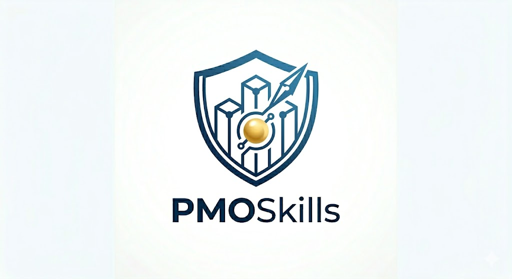
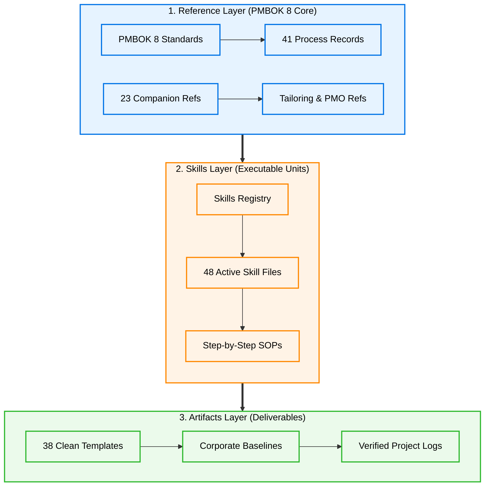

<p align="center">
  
</p>

<p align="center">
  
  
  
  
</p>

---

## 🎯 Executive Overview

Welcome to **PMOSkills**, the industry's first **executable skill system** and authoritative PMO reference architecture built directly upon the **PMI PMBOK® 8th Edition** and 23 secondary companion standards. 

Traditional template libraries are passive. **PMOSkills is dynamic.** It bridges the gap between high-level management standards and actual workspace execution, serving as a unified operating system for both:
1. 👔 **Human Project Practitioners & PMO Directors** seeking repeatable, high-quality, and compliant delivery methods.
2. 🤖 **AI Agents & LLM Co-Pilots** requiring highly structured, deterministic, and machine-readable project management ontologies to automate PMO tasks.

> [!NOTE]
> **Independent Academic Project:** This repository contains summaries, templates, and compliance test suites compiled from public project management frameworks. *PMBOK* and *PMI* are registered trademarks of the Project Management Institute, Inc. This project is independently developed and is not affiliated with or endorsed by PMI.

---

## 🗺️ System Architecture

The repository is designed around a three-tier interaction model where the **Reference Layer** feeds the **Skills Layer**, which programmatically outputs high-integrity **Artifacts**:



---

## 👔 The Human Practitioner Pathway

### Operationalizing PMBOK 8
For PMO Directors and Project Managers, this repository represents a pre-audited, governance-aligned toolkit that ensures your project meets the highest PMI quality standards from day one.

#### 🚀 Quick-Start SOP:
1. **Navigate the Catalog:** Consult [`docs/user-friendly-guide.md`](docs/user-friendly-guide.md) to select your delivery lifecycle (**Predictive (Waterfall)**, **Adaptive (Agile)**, or **Hybrid**).
2. **Find the Skill:** Look up the specific action in [`SKILL-REGISTRY.md`](SKILL-REGISTRY.md) (e.g., `SKL-03-15: Develop Budget`) to read its inputs, detailed steps, and quality constraints.
3. **Instantiate the Template:** Copy the associated template file from the [`artifacts/`](artifacts/) directory into your project workspace.
4. **Apply Authority Routing:** Consult the T1-T4 Decision Threshold model in [`AUTHORITY-ROUTING.md`](AUTHORITY-ROUTING.md) to align approval levels and project change tolerances.

---

## 🤖 The AI Agent Developer Pathway

### Autonomous Co-Piloting
For AI Engineers, LLM prompt designers, and autonomous agent frameworks, this repository provides a machine-readable, zero-dependency environment. Every folder and file is structured to be instantly parsable, enabling LLMs to act as autonomous PMO co-pilots.

#### ⚙️ Machine-Readable Interface Specifications:
* **JSON/YAML Front-Matter:** Every markdown document starts with a strict `GOV` YAML front-matter block, specifying `gov_id`, `gov_name`, `version`, `status`, and `authority` for easy extraction.
* **Deterministic Mappings:** Mappings between PMBOK 8 principles, domains, and processes are mathematically defined in [`PRINCIPLES-CROSSWALK.md`](PRINCIPLES-CROSSWALK.md) and [`LIFECYCLE-MAP.md`](LIFECYCLE-MAP.md).
* **3-Tier Continuous QA Gates:** Programmatic validation rules are defined in [`tests/pmbok8-compliance-test-plan.md`](tests/pmbok8-compliance-test-plan.md) and programmatically checked via [`shared/validate_structure.py`](shared/validate_structure.py) ensuring zero malformed schemas, broken links, or empty placeholders.

> [!TIP]
> **AI Agent Prompting Directive:** When initializing an LLM agent on this repository, inject the following system prompt:
> *"You are an AI PMO Co-Pilot. Use `SKILL-REGISTRY.md` as your master API index. Locate required skill steps, construct clean templates from `artifacts/` without editing pre-filled brackets, and route all outputs according to `AUTHORITY-ROUTING.md` thresholds."*

---

## 📂 Repository Directory Map

The canonical, audited structure of the PMOSkills knowledge base:

```
PMOSkills/
│
├── .github/                         ← Staged repository workflows and issue templates
│   ├── CODE_OF_CONDUCT.md
│   ├── CONTRIBUTING.md
│   └── SECURITY.md
│
├── Archive/                         ← Archived historical drafts, logs, and legacy files
│   ├── COMPLETION-PLAN.md
│   ├── legacy/
│   └── meta/
│
├── docs/                            ← Premium manuals and user handbooks
│   ├── img/                         ← Images and logos
│   ├── user-friendly-guide.md       ← Master Onboarding Handbook (Human + AI)
│   └── [custom guides: kebab-case.md]
│
├── reference/                       ← The Core PMBOK 8 Reference Layer (115 files)
│   ├── README.md                    ← Reference layer catalog and rules
│   ├── principles/                  ← 12 PMBOK 8 principles (P01–P12 + index)
│   ├── performance-domains/         ← 8 performance domains (PD01–PD08 + index)
│   ├── focus-areas/                 ← 5 focus areas (FA01–FA05)
│   ├── processes/                   ← 41 process records (PR01–PR41 + indices)
│   ├── knowledge-areas/             ← Knowledge Area index
│   ├── tools-techniques/            ← Tools & Techniques taxonomy index
│   ├── inputs-outputs/              ← Inputs & Outputs registry index
│   ├── companion-references/        ← 23 canonical companion reference manuals
│   ├── tailoring/                   ← Tailoring guidelines layer
│   ├── pmo/                         ← PMO governance & service models
│   └── appendices/                  ← PMO, AI, Sourcing, Evolution appendices (X2–X5)
│
├── skills/                          ← The Executable Skills Layer (48 files)
│   ├── 01-organizational-setup/     ← Governance and repo configuration (3 skills)
│   ├── 02-initiating/               ← Startup and chartering (2 skills)
│   ├── 03-planning/                 ← Comprehensive subsidiary planning (18 skills)
│   ├── 04-executing/                ← Delivery, risk responses, resources (9 skills)
│   ├── 05-monitoring-controlling/   ← Baseline tracking, change controls (9 skills)
│   ├── 06-closing/                  ← Transition, archivals, reviews (3 skills)
│   └── 07-adaptive-hybrid/          ← Backlogs, iterations, hybrids (4 skills)
│
├── artifacts/                       ← Lean and Audited Artifacts Catalog (78 templates)
│   ├── initiating/                  ← Project startup baselines (A01, A02, A04)
│   ├── planning-and-baselines/      ← Subsidiary management plans (A06, A08, A14, A15, A16, A28)
│   ├── resources/                   ← Resource registries and team documents (A03, A20, A25, A26, A27)
│   ├── stakeholders-communications/ ← Stakeholder matrices and plans (A07, A10, A28, A29)
│   ├── procurement/                 ← Supplier agreements and bid records (A11, A31, A32, A33)
│   ├── quality/                     ← Requirements traceability lists (A09, A13)
│   ├── knowledge/                   ← Lessons learned and data registers (A30)
│   ├── monitoring-and-decisions/    ← Status reporting, change logs, risk registers
│   ├── closure/                     ← Realization & transition logs (A24, A27)
│   ├── governance/                  ← Retention & privacy registers (A05, A34, A35, A37, A39)
│   ├── pmo/                         ← PMO metrics & improvements (A23, A36)
│   └── portfolio/                   ← Strategic portfolio alignment registers (A22)
│
├── shared/                          ← Programmatic elements and reusable components (25 files)
│   ├── README.md
│   ├── components/                  ← Field blocks and segment patterns
│   ├── validators/                  ← Automated waste-testing and metrics routines
│   ├── routing/                     ← Authority routing algorithms
│   └── checklists/                  ← Stage gate readiness lists
│
└── tests/                           ← The Verification and Test Layer (69 files)
    ├── README.md
    ├── pmbok8-compliance-test-plan.md ← 3-tier continuous integration test plan
    ├── skill-tests/                 ← 48 automated test suites
    └── integration-tests/           ← 7 end-to-end integration scenario scripts
```

---

## 📊 Repository Scorecard

| Component | Target Count | Built / Verified | Completion Rate |
|---|:---:|:---:|:---:|
| **Reference Layer (Principles, Domains, Indices)** | 115 | 115 | 100% ✅ |
| **Skills Layer (48 skills across 7 packs)** | 48 | 48 | 100% ✅ |
| **Artifacts Layer (Templates and examples)** | 78 | 78 | 100% ✅ |
| **Shared Components (Validators and checklists)** | 25 | 25 | 100% ✅ |
| **Test Suite (Skill + integration scenario tests)** | 69 | 69 | 100% ✅ |
| **Documentation & Framework Guides** | 6 | 6 | 100% ✅ |
| **Total Verified Assets** | **341** | **341** | **100% PRODUCTION READY** |

---

## ⚖️ Governance & Decision Threshold Matrix

To ensure clear accountability, PMOSkills employs a strict **T1 to T4 Decision Threshold Model** (detailed in [`AUTHORITY-ROUTING.md`](AUTHORITY-ROUTING.md)):

| Band | Characteristics | Default Authority | Action Pathway |
|---|---|---|---|
| **T1 Operational** | Localized, low risk, within baseline tolerances | Project Manager (PM) | Execute & log in change register |
| **T2 Controlled** | Material impact on one baseline (e.g., schedule delay < 10%) | Change Control Board (CCB) / Sponsor | Submit formal CR via Skill `SKL-05-02` |
| **T3 Governance** | Material impact on multiple baselines, strategic target risk | Project Governing Body / Sponsor | Elevate to OPM board per Routing Schema |
| **T4 Enterprise** | Strategic realignment, regulatory, or cross-portfolio impact | Portfolio Authority / PMO Executive | Executive governance intervention |

---

## 🚀 Key Framework Documents

* 🔍 [`SKILL-REGISTRY.md`](SKILL-REGISTRY.md) — Master index of all 48 skills, dependency chains, and primary outputs.
* 🏷️ [`RELEASE-NOTES-v0.1.md`](RELEASE-NOTES-v0.1.md) — Release notes for stable v0.1 milestone.
* ⚖️ [`AUTHORITY-ROUTING.md`](AUTHORITY-ROUTING.md) — RACI matrix and escalation protocols for T1–T4 decisions.
* 📈 [`LIFECYCLE-MAP.md`](LIFECYCLE-MAP.md) — Linear and hybrid process and artifact flow diagrams.
* 📋 [`QUALITY-STANDARDS.md`](QUALITY-STANDARDS.md) — The single source of truth for YAML front-matter schemas and quality validation gates.
* 🧪 [`tests/pmbok8-compliance-test-plan.md`](tests/pmbok8-compliance-test-plan.md) — 3-tier testing gate rules checking syntax, semantics, and system integration.

---

## 📈 Version History

* **`v0.1` (2026-06-02):** **First Stable Framework Release.** Promoted the audited PMOSkills repository (341 assets) under official git release tag `v0.1`. Indexed master checklists and release notes.
* **`v4.8.0` (2026-06-02):** Phase 8 Next Steps & Compliance Integration. Introduced the master user onboarding guide (`docs/user-friendly-guide.md`) and the 3-tier test plan (`tests/pmbok8-compliance-test-plan.md`). Fully updated master scorecards and plan directories.
* **`v4.7.0` (2026-06-02):** Phase 6 Test Suites and Phase 7 Quality Audit Complete. Implemented 48 skill test suites, 7 cross-skill integration flow tests, and cleaned mixed-case non-conformances.
* **`v4.5.0` (2026-06-01):** Phase 0 Repository Consolidation. Cleared legacy folders, monolithic drafts, and compiled clean reference layers.
* **`v1.3.0` (2026-05-30):** Full Skill catalog deployment. Standardized Packs 01 through 07 (48 skills).

---

*Authority: PMBOK 8 Primary · PMI Companion References Secondary · Organization-Defined Tertiary*  
*Project: PMI PMBOK 8 Knowledge Base Repository Space*  
*Maintainer:* **Mohamed Fouad Fakhruldeen *[GitHub](https://github.com/fakhruldeen), [LinkedIn](https://www.linkedin.com/in/fakhruldeen), [Website](https://fakhruldeen.me)***