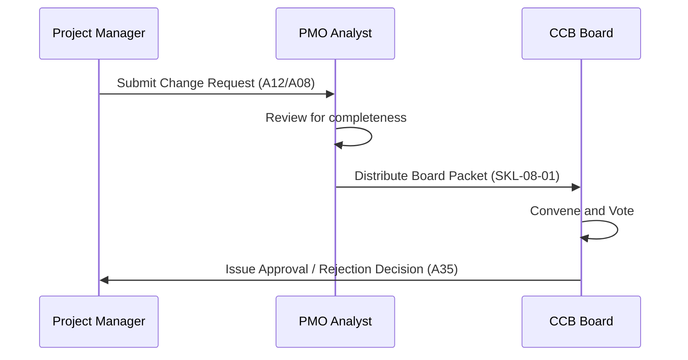

## [A35] — Change Control Board (CCB) SOP | Template

> **Usage note:** This is a template for the standard operating procedures of the Change Control Board. Replace every `[FIELD: ...]` placeholder with project-specific content.

---

## Section 1 — Header / Identification

| Field | Value |
|---|---|
| Project Name | [FIELD: full project name] |
| Project Manager | [FIELD: PM name] |
| Document Version | [FIELD: e.g., v1.0] |
| Status | [FIELD: Draft / Active / Under Review] |
| Date | [FIELD: YYYY-MM-DD] |

---

## Section 2 — Purpose and Authority

The Change Control Board (CCB) is the formal governance body responsible for reviewing, evaluating, approving, deferring, or rejecting changes to project baselines (Scope, Schedule, Cost). Its authority is bound by the thresholds defined in `AUTHORITY-ROUTING.md`.

---

## Section 3 — CCB Membership

| Role | Standing Representative | Alternate | Voting Rights |
|---|---|---|---|
| **Sponsor (Chair)** | [FIELD: Name] | [FIELD: Name] | Yes (Deciding Vote) |
| **Project Manager** | [FIELD: Name] | [FIELD: Name] | Advisory (Non-voting) |
| **PMO Director** | [FIELD: Name] | [FIELD: Name] | Advisory (Non-voting) |
| **Technical Lead** | [FIELD: Name] | [FIELD: Name] | Yes |
| **Business Analyst** | [FIELD: Name] | [FIELD: Name] | Yes |

---

## Section 4 — Step-by-Step Change Process

1.  **Submission:** The PM submits a formal change request (CR) using the template.
2.  **Review:** PMO validates the request and performs initial impact analysis.
3.  **Agenda:** Approved CRs are added to the next CCB meeting agenda.
4.  **Presentation:** The PM presents the CR, options, and recommended path.
5.  **Decision:** CCB votes and records the decision in the Decision Record (`A35`).
6.  **Updating:** If approved, baselines are updated and logged in the Change Log.

---

## Section 5 — CCB Meeting Cadence and Quorum

*   **Cadence:** [FIELD: e.g., Bi-weekly or ad-hoc if a critical threshold is breached]
*   **Quorum Requirement:** [FIELD: e.g., Chair + technical representative + 1 voting member]

---

## Section 6 — Waste Test

- [ ] Meetings are only held when active CRs exist — no meetings "just to catch up" (waiting/motion waste).
- [ ] Non-voting advisory roles do not require attendance unless requested for specific expert judgment.

---

## Change Log

| Version | Date | Author / Event | Description |
|---|---|---|---|
| 1.0.0 | 2026-06-07 | PMO Director | Initial CCB SOP template |

---

*Template for: Change Control Board SOP*  
*Authority: PMBOK8 Guide Governance Performance Domain · GPPP*  
*See definition file: `artifacts/governance/A35-governance-decision-authority-record.md`*
