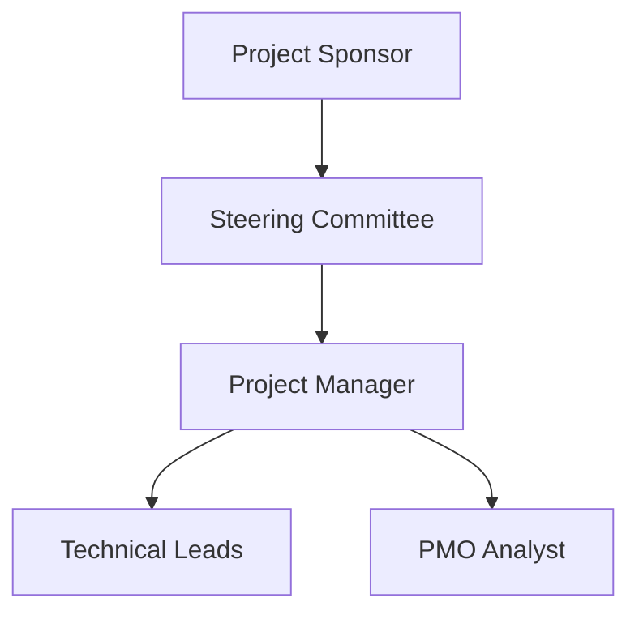

## [A35] — Project Governance Charter | Template

> **Usage note:** This is a template for defining the project governance structure, decision rights, and reporting paths. Replace every `[FIELD: ...]` placeholder with project-specific content.

---

## Section 1 — Header / Identification

| Field | Value |
|---|---|
| Project Name | [FIELD: full project name] |
| Project Manager | [FIELD: PM name] |
| Document Version | [FIELD: e.g., v1.0] |
| Status | [FIELD: Draft / Active / Under Review] |
| Date | [FIELD: YYYY-MM-DD] |

---

## Section 2 — Governance Structure & Reporting Paths

This Project Governance Charter establishes the oversight structure, decision-making authority boundaries, and escalation protocols for the project.

---

## Section 3 — Key Roles and Responsibilities

| Role | Governance Responsibility | Decision Authority Limits |
|---|---|---|
| **Project Sponsor** | Final project funding and strategic alignment | Approves T3/T4 baseline modifications |
| **Steering Committee** | Oversight, barrier resolution, cross-functional alignment | Approves T3 project level changes |
| **Project Manager** | Daily management, execution control, status reporting | Approves T1 and T2 changes within threshold limits |
| **PMO Director** | Methodology alignment, template auditing, status tracking | Advisory role; enforces standards compliance |

---

## Section 4 — Escalation Protocols

Issues or decisions that exceed the delegated authority of the Project Manager (e.g. `T1` limits) must be escalated immediately:

1.  **Level 1 (PM to PMO/Sponsor):** For T2 changes or warnings. Initial review within 24 hours.
2.  **Level 2 (Sponsor to Steering Committee):** For T3 changes or critical warnings. Decision within 5 business days.
3.  **Level 3 (Steering Committee to Executive Board):** For T4/Strategic changes. Resolution at next scheduled board meeting.

---

## Section 5 — Waste Test

- [ ] Decision paths are linear with no circular loops or redundant approval steps.
- [ ] Escalation time limits are defined to prevent work waiting/delay waste.

---

## Change Log

| Version | Date | Author / Event | Description |
|---|---|---|---|
| 1.0.0 | 2026-06-07 | PMO Director | Initial Project Governance Charter template |

---

*Template for: Project Governance Charter*  
*Authority: PMBOK8 Guide Governance Performance Domain · GPPP*  
*See definition file: `artifacts/governance/A35-governance-decision-authority-record.md`*
