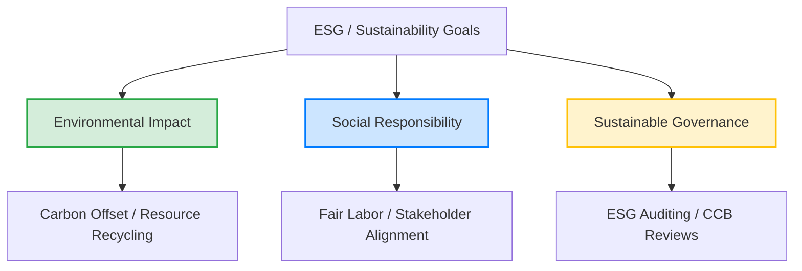

# Sustainability and ESG Application Guide

This guide establishes the standardized principles, metrics, and workflows for integrating **Sustainability and Environmental, Social, and Governance (ESG)** goals into all project delivery areas, directly aligning with **PMBOK 8th Edition Standard Principle 6: Integrate Sustainability Within All Project Areas (§4.6)**.

---

## 1. Sustainability in PMBOK 8

In modern project management, sustainability is no longer an optional "add-on." Under the PMBOK 8th Edition framework, every project is a micro-ecosystem that consumes resources, impacts stakeholders, and leaves a long-term social and environmental footprint. 

---

## 2. PMBOK 8 Performance Domain Mappings

Apply ESG goals strategically across the core Performance Domains:

### 2.1 Scope Domain
* **Action:** Include sustainability requirements (e.g., recyclable materials, energy-efficient cloud hosting) inside the **Requirements Traceability Matrix (RTM)** (`PR05`) and the **Project Scope Statement** (`PR06`).
* **Metric:** Percentage of requirements directly tied to ESG parameters.

### 2.2 Finance Domain
* **Action:** Incorporate long-term environmental cleanup, energy costs, and recycling offsets in the definitive **Cost Estimates** (`PR15`) and **Cost Baseline** (`PR16`).
* **Metric:** ESG Return on Investment (e-ROI).

### 2.3 Resources & Procurement Domain
* **Action:** Evaluate suppliers using standard **ESG Vendor Scorecards** and mandate sustainable packaging in procurement agreements (`PR26`).
* **Metric:** Percentage of contracted vendors with active ESG certifications.

### 2.4 Risk Domain
* **Action:** Log climate change, regulatory changes, and resource scarcity in the project **Risk Register** (`PR22`).
* **Metric:** Risk reserves allocated specifically for environmental threats.

---

## 3. Standard Sustainability Metrics

Measure project sustainability success using these four quantitative categories:

| Metric Category | Standard Metric | Formula / Measurement Method |
|---|---|---|
| **Environmental** | Carbon Footprint ($CO_2e$) | Total greenhouse gas emissions generated by project operations. |
| **Waste Management**| Waste Diverted (%) | $\frac{\text{Weight of Recycled Waste}}{\text{Total Weight of Waste Generated}} \times 100$ |
| **Social** | Fair Labor Compliance | 100% adherence to corporate labor safety and equity benchmarks. |
| **Governance** | ESG Vendor Ratio | $\frac{\text{Active ESG-Certified Vendors}}{\text{Total Contracted Vendors}} \times 100$ |

---

## 4. Sustainability Integration Checklist

Verify that your project satisfies PMBOK 8 sustainability standards during initiation and planning:

- [ ] **Are ESG requirements documented?** Verify that environmental parameters are recorded in the Scope Statement (`PR06`).
- [ ] **Is the supply chain sustainable?** Confirm that sourcing evaluations include ESG criteria (`PR26`).
- [ ] **Are climate risks identified?** Ensure climate and environmental regulatory threats are logged in the Risk Register (`PR22`).
- [ ] **Is post-project footprint considered?** Confirm that system decommissioning and recycling paths are planned.

---

*Authority: PMBOK8 Core Standard Principle 6 (§4.6) · PMOSkills Repository*
