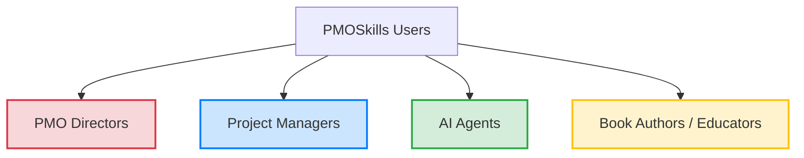

# PMOSkills Repository Audience Usage Guide

This guide establishes the primary navigation pathways, key resource mappings, and operational checklists tailored for the four primary user groups of the **PMOSkills** repository.

---

## 1. Audience Navigation Overview

---

## 2. Audience Target Paths & Checklists

### 2.1 PMO Directors & Governance Leads
* **Objective:** Establish corporate project management governance frameworks, audit process compliance, and scale PMO capability maturity levels.
* **Primary Navigation Path:**
  1. Read the [Executive Guide to Agentic PMO & MCP](file:///home/mohamed/Desktop/Work/PMSkills/github/PMOSkills/docs/general/pmo-executive-guide-ai-mcp.md) for a 10,000-ft conceptual introduction to AI, Agents, and MCP using PMO terms.
  2. Start with [Appendix X2: PMO Integration](file:///home/mohamed/Desktop/Work/PMSkills/github/PMOSkills/reference/appendices/X2-pmo.md) to understand PMO archetypes and Change Control Board setups.
  3. Review the [PMO Reference Layer Index](file:///home/mohamed/Desktop/Work/PMSkills/github/PMOSkills/reference/pmo/index.md) and [PMO Standard Services](file:///home/mohamed/Desktop/Work/PMSkills/github/PMOSkills/reference/pmo/pmo-services.md).
  4. Deploy the [Governance Tailoring Guide](file:///home/mohamed/Desktop/Work/PMSkills/github/PMOSkills/reference/tailoring/tailoring-governance.md) to set standard change control boundaries.
* **PMO Director Checklist:**
  - [ ] Baseline the corporate [PMO Maturity rating](file:///home/mohamed/Desktop/Work/PMSkills/github/PMOSkills/reference/pmo/pmo-maturity-model.md).
  - [ ] Set up the pre-approved [T1–T4 Authority Routing rules](file:///home/mohamed/Desktop/Work/PMSkills/github/PMOSkills/AUTHORITY-ROUTING.md).
  - [ ] Align organizational cost rules with the [Finance Tailoring guide](file:///home/mohamed/Desktop/Work/PMSkills/github/PMOSkills/reference/tailoring/tailoring-finance.md).

### 2.2 Project Managers & Scrum Masters
* **Objective:** Select the correct development approach, execute daily planning and tracking processes, and generate compliant deliverables.
* **Primary Navigation Path:**
  1. Start with the [Tailoring Master Index](file:///home/mohamed/Desktop/Work/PMSkills/github/PMOSkills/reference/tailoring/index.md) and [Development Approaches Guide](file:///home/mohamed/Desktop/Work/PMSkills/github/PMOSkills/reference/tailoring/tailoring-approaches.md).
  2. Reference the [Process Catalog Index](file:///home/mohamed/Desktop/Work/PMSkills/github/PMOSkills/reference/processes/index.md) to step through PR01–PR41.
  3. Use the [Tools & Techniques Registry](file:///home/mohamed/Desktop/Work/PMSkills/github/PMOSkills/reference/tools-techniques/tools-techniques-registry.md) for direct estimation or risk calculation instructions.
* **Project Manager Checklist:**
  - [ ] Determine the project's [Complexity Tier (T1–T4)](file:///home/mohamed/Desktop/Work/PMSkills/github/PMOSkills/AUTHORITY-ROUTING.md).
  - [ ] Cross-reference all inputs and outputs using the [Inputs & Outputs Registry](file:///home/mohamed/Desktop/Work/PMSkills/github/PMOSkills/reference/inputs-outputs/inputs-outputs-registry.md).
  - [ ] Search [GLOSSARY.md](file:///home/mohamed/Desktop/Work/PMSkills/github/PMOSkills/reference/GLOSSARY.md) for core EVM formula definitions.

### 2.3 AI Agents & Automated Coding Assistants
* **Objective:** Parse process records, invoke correct structural templates, and generate standardized code or documentation with 100% schema compliance.
* **Primary Navigation Path:**
  1. Start with the [AI Agent Guide](file:///home/mohamed/Desktop/Work/PMSkills/github/PMOSkills/docs/ai-agents/ai-agent-guide.md).
  2. Parse [QUALITY-STANDARDS.md](file:///home/mohamed/Desktop/Work/PMSkills/github/PMOSkills/QUALITY-STANDARDS.md) to understand validation rules.
  3. Load the [Companion Source Usage Guide](file:///home/mohamed/Desktop/Work/PMSkills/github/PMOSkills/docs/ai-agents/source-usage-guide.md) to ensure proper metadata citation.
* **AI Agent Checklist:**
  - [ ] Confirm all generated front-matter matches the canonical `REF` or `PR` YAML schema.
  - [ ] Run [validate_structure.py](file:///home/mohamed/Desktop/Work/PMSkills/github/PMOSkills/shared/validate_structure.py) after making batch edits.
  - [ ] Do not hardcode placeholder values; reference the central registries.

### 2.4 Book Authors, Educators, & Trainers
* **Objective:** Map PMBOK 8th Edition core concepts to practical training modules and design realistic student assignments.
* **Primary Navigation Path:**
  1. Start with [Appendix X5: Evolution of PMI Standards](file:///home/mohamed/Desktop/Work/PMSkills/github/PMOSkills/reference/appendices/X5-evolution.md) to understand paradigm shifts.
  2. Use [PRINCIPLES-CROSSWALK.md](file:///home/mohamed/Desktop/Work/PMSkills/github/PMOSkills/PRINCIPLES-CROSSWALK.md) to teach the alignment of standards.
  3. Leverage the [Companion References Index](file:///home/mohamed/Desktop/Work/PMSkills/github/PMOSkills/reference/companion-references/index.md) to assign reading lists.
* **Educator Checklist:**
  - [ ] Use the [Skill Reference Map](file:///home/mohamed/Desktop/Work/PMSkills/github/PMOSkills/docs/skill-reference-map.csv) to trace specific student assignments to PMBOK 8 anchors.
  - [ ] Incorporate [Appendix X3: AI Integration](file:///home/mohamed/Desktop/Work/PMSkills/github/PMOSkills/reference/appendices/X3-ai.md) to teach modern tech-enabled PM competencies.

---

*Authority: PMBOK8 Core Standard & PMOSkills Repository*
