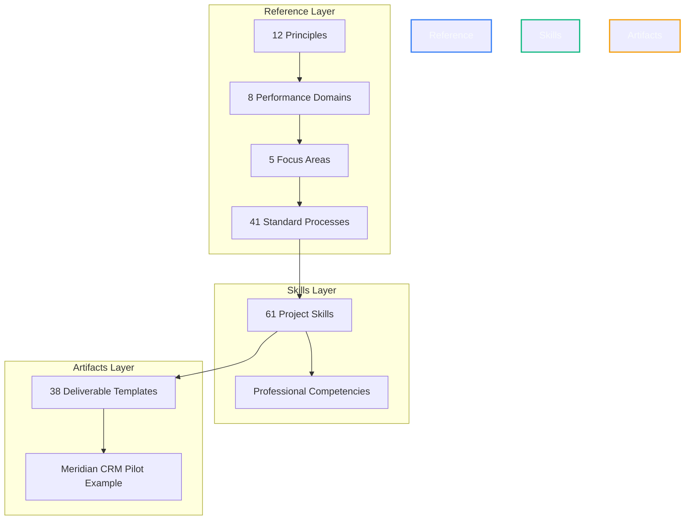

# PMOSkills Repository — Master Handbook & User Guide

Welcome to the **PMOSkills Repository**, the premier open-source, enterprise-grade project management validation and execution framework. Grounded in the **PMBOK® Guide – Eighth Edition** (Primary Authority) and aligned with the **23 PMI Companion References** (Secondary Authority), this repository serves as a dual-purpose system:
1. **A Practitioner's Manual:** Real-world templates, standard operating procedures, and skill checklists.
2. **An AI-Agent Knowledge Base:** Machine-readable structures, deterministic schemas, and test runners that enable autonomous project execution and validation.

---

## 1. Repository Architecture & The Three Layers

The repository is built around a highly structured, interconnected, three-layer architecture:



### 1.1 The Reference Layer (`reference/`)
* **Purpose:** The formal knowledge foundation mapping the PMBOK 8 standard.
* **Principles (`reference/principles/`):** Core philosophy (P01–P12) guiding all project decisions (e.g., Stewardship, Leadership, Quality).
* **Performance Domains (`reference/performance-domains/`):** Operational spheres of project work (PD01–PD08) (e.g., Stakeholders, Planning, Uncertainty).
* **Focus Areas (`reference/focus-areas/`):** The project phase groups (FA01–FA05) mapping Initiating, Planning, Executing, Monitoring & Controlling, and Closing.
* **Process Records (`reference/processes/`):** 41 granular project management processes detailing step-by-step inputs, tools, techniques, and outputs (PR01–PR41).
* **Companion References (`reference/companion-references/`):** Short-code references and index maps mapping secondary literature (e.g., Agile Practice Guide, Risk Management Standard).

### 1.2 The Skills Layer (`skills/`)
* **Purpose:** The human-capability and procedural checklists.
* **Organization:** Divided into 7 structured packs mapping organizational setup, initiating, planning, executing, monitoring, closing, and hybrid environments (Packs 01–07).
* **Skills (SKL-XX-YY):** 61 atomic skill manuals defining exact standard operating procedures, mandatory checklists, inputs, outputs, thresholds, and change logs.

### 1.3 The Artifacts Layer (`artifacts/`)
* **Purpose:** The tangible deliverables of a PMO.
* **Templates (`*-template.md`):** 38 fully audited, placeholder-driven, machine-validatable corporate document templates (e.g., Business Case, Project Charter, WBS, Risk Register).
* **Examples (`*-example.md`):** Real-world instantiations of the templates, utilizing the **Meridian CRM System Upgrade** case study (providing a consistent, cross-referencing predictive-to-adaptive scenario).

---

## 2. Standard Operating Procedures (SOPs) per Lifecycle

Depending on your organization's delivery model, follow the mapped navigation paths below to execute your project flawlessly.

### 2.1 Predictive Lifecycle (Waterfall / Plan-Driven)
When scope and requirements are stable, and predictability is paramount:

```
[Start Setup] ➔ [Initiate Project] ➔ [Develop Baselines] ➔ [Execute & Control] ➔ [Formal Closure]
```

1. **Step 1: Setup Governance**
   * Review [`SKL-01-01`](../skills/01-organizational-setup/SKL-01-01-establish-pm-governance-framework.md) to establish your governance framework.
   * Instantiate [`A05-context-register-template.md`](../artifacts/governance/A05-context-register-template.md) to record your organizational standards.
2. **Step 2: Initiate**
   * Follow processes [`PR01`](../reference/processes/PR01-develop-project-charter.md) and [`PR02`](../reference/processes/PR02-identify-stakeholders.md).
   * Instantiate [`A01-business-case-template.md`](../artifacts/initiating/A01-business-case-template.md) and [`A04-project-charter-template.md`](../artifacts/initiating/A04-project-charter-template.md).
3. **Step 3: Plan & Baseline**
   * Walk through skills in **Pack 03 (Planning)**.
   * Complete the triple constraints baselines: Scope ([`A13`](../artifacts/quality/A13-requirements-traceability-matrix-template.md)), Schedule ([`A15`](../artifacts/planning-and-baselines/A15-schedule-model-and-baseline-record.md)), and Cost ([`A16`](../artifacts/planning-and-baselines/A16-financial-management-and-cost-baseline-record.md)), culminating in the master Integrated Project Management Plan ([`A14`](../artifacts/planning-and-baselines/A14-integrated-project-management-plan.md)).
4. **Step 4: Execute & Control**
   * Use [`A18-issue-impediment-action-log-template.md`](../artifacts/monitoring-and-decisions/A18-issue-impediment-action-log-template.md) and [`A19-risk-management-record-template.md`](../artifacts/monitoring-and-decisions/A19-risk-management-record-template.md) to maintain log integrity.
   * Run decision thresholds via the [`threshold-router.md`](../shared/routing/threshold-router.md).
5. **Step 5: Close**
   * Execute closure routines using [`A24-closure-and-benefits-transition-record-template.md`](../artifacts/closure/A24-closure-and-benefits-transition-record-template.md) and record lessons learned in [`A21`](../artifacts/monitoring-and-decisions/A21-lessons-learned-record-template.md).

### 2.2 Adaptive Lifecycle (Agile / Change-Driven)
When requirements are highly volatile, and value must be delivered incrementally:

```
[Define Vision] ➔ [Release Planning] ➔ [Iterative Sprints] ➔ [Demo & Retrospective] ➔ [Value Transfer]
```

1. **Step 1: Scoping & Visioning**
   * Utilize adaptive skills in **Pack 07 (Adaptive/Hybrid)**.
   * Instantiate [`A28-agile-product-backlog-and-vision-record-template.md`](../artifacts/agile-and-adaptive/A28-agile-product-backlog-and-vision-record-template.md) to define product vision and initial Epic list.
2. **Step 2: Roadmapping & Release Planning**
   * Map dependencies via [`A22-portfolio-interdependency-record-template.md`](../artifacts/portfolio/A22-portfolio-interdependency-record-template.md).
   * Plan releases using story mapping techniques documented in [`SKL-07-02`](../skills/07-adaptive-hybrid/SKL-07-02-facilitate-collaborative-story-mapping.md).
3. **Step 3: Sprint Execution**
   * Run iterative cycles using sprint backlogs, daily standups, and Kanban boards as described in [`SKL-07-03`](../skills/07-adaptive-hybrid/SKL-07-03-manage-sprint-execution-and-kanban-flow.md).
   * Monitor velocity and burn-down charts via [`A30-agile-sprint-backlog-and-burndown-record-template.md`](../artifacts/agile-and-adaptive/A30-agile-sprint-backlog-and-burndown-record-template.md).
4. **Step 4: Continuous Quality Assurance**
   * Run the Waste Test validator [`waste-test.md`](../shared/validators/waste-test.md) at the end of each sprint to detect TIMWOODS waste in administrative and developer processes.
5. **Step 5: Release & Retro**
   * Close sprints using retrospectives and transition value via [`A24`](../artifacts/closure/A24-closure-and-benefits-transition-record-template.md).

---

## 3. How to Instantiate Templates

All corporate document templates in `artifacts/` follow a standardized formatting convention. To instantiate them in your PMO:

1. **Copy the Template:** Copy the `*-template.md` file to your active project workspace.
2. **Preserve Front-Matter:** Ensure the YAML front-matter block remains intact, updating the `status` from `Template` to `Active`, and providing your specific `project_id`.
3. **Input Data Fields:** Replace all descriptive blocks (e.g. `[FIELD: Cost Baseline Description]`) with your project's actual data.
4. **DO NOT PRE-FILL:** Never leave placeholders in a finalized project record. Ensure all inputs are concrete and complete.
5. **Validate Integrity:** Run the shared quality checker `shared/validators/artifact-quality-check.md` to ensure that no placeholder tags remain in the instantiated document.

---

## 4. AI-Agent Orchestration & Automation

This repository is designed to be fully machine-readable. AI agent co-pilots can read, write, audit, and refactor files by adhering to these guidelines:

### 4.1 System Context Injection
When starting an LLM session, paste the contents of [`Archive/session-start-prompt.md`](../Archive/session-start-prompt.md) to ground the agent in the project's authority routing, file naming standards, and task scopes.

### 4.2 Automated Quality Gates
All files created or modified by AI agents must strictly pass the quality checklist defined in [`QUALITY-STANDARDS.md §9`](../QUALITY-STANDARDS.md#9-ai-agent-pre-commit-checklist). The system enforces:
* **L1 (Structural Gates):** YAML front-matter compliance, unique IDs, header hierarchy, and link validation.
* **L2 (Content Gates):** Specific field compliance, zero placeholder retention, and PMBOK 8 section citation integrity.
* **L3 (System Integration Gates):** Cross-link checks between related reference, skill, and test suites.

### 4.3 Running Validation Scripts
Run structural validation tests using the terminal command:
```bash
python3 shared/validate_structure.py
```
This script audits the repository folders, confirms the absence of duplicate files, and ensures that file permissions and structures match the canonical roadmap.
