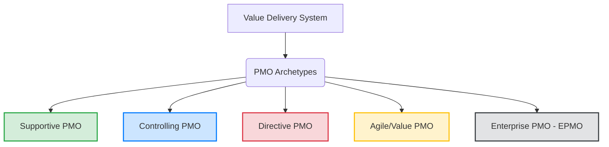

# Appendix X2 — PMO Integration & Governance

**Ref ID:** APP-X2  
**Type:** Appendix  
**PMBOK8 Source:** PMBOK 8 Governance Performance Domain  
**Companion Reference:** PMO Practice Guide (PMO-PG)  
**Version:** 1.0.0  
**Status:** Active  

---

## 1. Purpose & Scope

This appendix outlines the operational integration of the **Project Management Office (PMO)** and its associated governance frameworks with the **PMBOK 8th Edition Performance Domains**. As projects shift from linear process compliance to complex value-delivery systems, the PMO acts as the vital governance bridge, ensuring strategic alignment, resource optimization, and consistent measurement.

---

## 2. PMO Archetypes in Value Delivery Systems

Under PMBOK 8 and the PMO Practice Guide, the PMO is no longer just a "reporting hub." It is categorized into five strategic archetypes based on control levels and business focus:



### 2.1 Supportive PMO
* **Control Level:** Low (Consultative)
* **Core Functions:** Provides templates, training, lessons learned databases, and historical process guidelines.
* **Typical Project Type:** Low-complexity, localized projects with autonomous project managers.

### 2.2 Controlling PMO
* **Control Level:** Medium (Compliance-driven)
* **Core Functions:** Enforces conformance to methodologies, frameworks, quality baselines, and specific PMI tools.
* **Typical Project Type:** Medium-complexity projects subject to regulatory audits.

### 2.3 Directive PMO
* **Control Level:** High (Direct management)
* **Core Functions:** Directly owns, staffs, and manages project execution. Project Managers report directly to the PMO.
* **Typical Project Type:** Large-scale, high-risk organizational initiatives.

### 2.4 Agile Value Delivery Office (VDO)
* **Control Level:** Adaptive / Facilitative
* **Core Functions:** Acts as a coaching center of excellence, managing value streams, removing organizational roadblocks, and facilitating iterative development cycles.
* **Typical Project Type:** Hyper-iterative, software, or highly volatile market initiatives.

### 2.5 Enterprise PMO (EPMO)
* **Control Level:** Strategic Governance
* **Core Functions:** Aligns program and portfolio dependencies with enterprise business strategy and financial targets.
* **Typical Project Type:** Full portfolio of programs, operations, and initiatives.

---

## 3. PMO-Performance Domain Mapping Matrix

PMOs add value across all eight PMBOK 8 Performance Domains by executing specific governance services:

| Performance Domain | PMO Strategic Services | Associated Key Artifacts |
|---|---|---|
| **1. Stakeholders** | Facilitates stakeholder alignment workshops, manages escalations, and audits engagement matrixes. | A07 Stakeholder Register |
| **2. Team** | Leads training programs, administers PM skills tracking, and monitors resource capacity modeling. | Skill Registry, Team Charter |
| **3. Life Cycle** | Mandates and supports tailoring guidelines for predictive, agile, and hybrid development approaches. | Tailoring Guidelines |
| **4. Planning** | Moderates baseline reviews and reconciles schedules with portfolio resource limits. | A15 Schedule Baseline, A16 Cost Baseline |
| **5. Project Work** | Audits lessons learned records, coordinates change control boards, and handles supplier disputes. | Issue Log, Change Requests |
| **6. Delivery** | Validates the business case alignment, benefits realization logs, and product transition schedules. | Accepted Deliverables, Final Report |
| **7. Measurement** | Consolidates Earned Value reports, calculates portfolio KPIs, and publishes executive dashboards. | Work Performance Reports, EVA Logs |
| **8. Uncertainty** | Conducts portfolio-level qualitative risk audits and administers contingency reserves. | A19 Risk Register, Risk Reports |

---

## 4. Governance Framework: The Change Control Board (CCB)

Governance ensures that changes to scope, schedule, or cost baselines are structured, analyzed, and formally approved. The PMO operates as the administrative backbone of the **Change Control Board (CCB)**:

```
[Change Proposed (PR30)] 
  ──► [PMO Performs Alternatives & Cost-Benefit Analysis]
        ──► [CCB Review Meeting (PR31)]
              ├──► APPROVED  ──► [Update Baselines & Notify Team (PR28)]
              └──► REJECTED  ──► [Log Decision in Change Log & Inform Sponsor]
```

### 4.1 Scenario Integration (Meridian CRM System Upgrade)
In the *Meridian CRM System Upgrade* scenario, a request was submitted to expand the scope to integrate a legacy customer support module. 
* **The PMO's Role:** Reconciled the request with the Cost Management Plan, ran a reserve analysis showing a $15,000 impact, and facilitated the CCB vote.
* **Outcome:** The change was approved as `CR-012`, baselines were re-established via `PR12` and `PR16`, and the update was pushed to execution in `PR28`.

---

## 5. PMO Governance Practitioner Checklist

Practitioners should leverage the PMO to secure project alignment and governance compliance:

- [ ] **Tailoring Approval:** Engage the PMO in the project initiation stage to review and approve the project lifecycle tailoring selections.
- [ ] **Baseline Authorization:** Submit cost, schedule, and scope baselines to the PMO review board before requesting executive sign-off.
- [ ] **Risk Register Escalation:** Escalate risks with a probability-impact rating exceeding the individual project threshold to the portfolio registry.
- [ ] **Lessons Learned Capture:** Record and file lessons learned at the end of each sprint or phase directly in the PMO central asset store.
- [ ] **Deliverable Transition Gate:** Complete a PMO-led gate audit before transitioning accepted deliverables to production/customer custody.

---

*Authority: PMBOK8 Guide §2.3 · PMO Practice Guide §1–§4*
