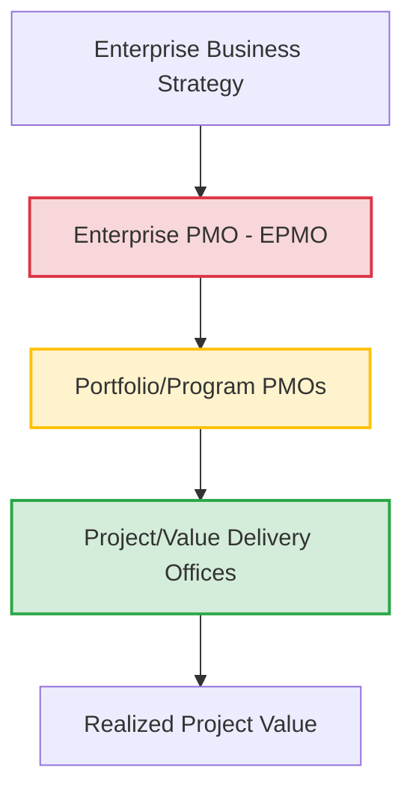

# PMO Reference Layer Index

**Ref ID:** PMO-INDEX  
**Type:** FocusArea  
**PMBOK8 Source:** PMBOK 8 Appendix X2 · PMO Practice Guide §1–§2  
**Version:** 1.0.0  
**Status:** Active  

---

## 1. Purpose of the PMO Reference Layer

In modern value-delivery systems, the **Project/Program/Portfolio Management Office (PMO)** acts as the critical engine of project governance, standard enablement, capability improvement, and strategic alignment. This reference layer bridges the high-level governance guidelines in the **PMBOK 8th Edition** with the highly granular, execution-oriented standards in the **PMI PMO Practice Guide**.

---

## 2. PMO Value Delivery Framework

The PMO operates as a multi-tier governance system that translates strategic business intent into structured project outcomes:

---

## 3. Reference Layer Directory

Navigate the deep governance structures and capabilities of modern PMOs using these dedicated reference guides:

*   [PMO Types](./pmo-types.md) — 20+ PMO archetypes categorized by scope, control levels, business focus, and specific use cases.
*   [PMO Services](./pmo-services.md) — The 26 standardized PMO services across 7 service categories, each mapped to a 5-level maturity scale.
*   [PMO Services Catalog](./pmo-services-catalog.md) — Mapping the 26 standard services to executable skills and artifacts.
*   [PMO Competencies](./pmo-competencies.md) — The 30 core competencies for PMO professionals across Design, Operation, and Improvement domains.
*   [PMO Customer Outcomes](./pmo-outcomes.md) — The 30 standard customer outcomes that a mature PMO delivers to its stakeholders with diagnostics.
*   [PMO Maturity Model](./pmo-maturity-model.md) — The 5-level service maturity framework used to audit and scale PMO capabilities.

---

*Authority: PMBOK8 Guide Appendix X2 · PMO Practice Guide §1–§2*
