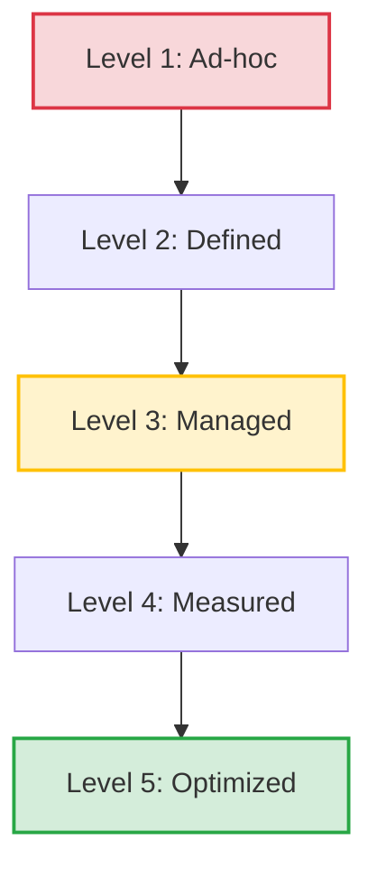

# PMO Service Maturity Model

**Ref ID:** PMO-MATURITY  
**Type:** FocusArea  
**PMBOK8 Source:** PMBOK 8 Appendix X2 · PMO Practice Guide §3  
**Version:** 1.0.0  
**Status:** Active  

---

## 1. The 5-Level Service Maturity Model

The **PMO Service Maturity Model** evaluates the quality, consistency, and capability of a Project Management Office across 5 developmental stages. PMOs use this model to baseline their current state, set improvement targets, and justify operational investments.

---

## 2. Maturity Level Breakdown

### Level 1: Ad-hoc (Initial / Chaotic)
* **Description:** Project management processes are unstructured, undocumented, and executed inconsistently. Success depends on individual heroics rather than standard frameworks.
* **Key Characteristics:** 
  * Simple stubs and checklists; no standardized PMIS software setup.
  * Budget estimates and timelines are based on ad-hoc guesses.
  * Risk management is reactive (dealing with issues after they occur).
* **PMO Focus:** Survival and reactive crisis management.

### Level 2: Defined (Repeatable / Structured)
* **Description:** Basic project management templates and processes are established. Success is repeatable across similar initiatives.
* **Key Characteristics:**
  * Core documents (Project Charter, Stakeholder Register) are standardized.
  * MS Project or similar tools are introduced.
  * Financial tracking is limited to comparing actual costs to the total budget limit.
* **PMO Focus:** Standardization of templates and compliance monitoring.

### Level 3: Managed (Standardized / Documented)
* **Description:** Project management processes are documented, standardized, and integrated across all active organizational units.
* **Key Characteristics:**
  * Centralized PMIS platform (Jira/Confluence) is fully adopted.
  * Formal Change Control Board (CCB) and authority levels are enforced (PR31).
  * Earned Value Management (EVM) metrics track progress monthly.
* **PMO Focus:** Operational excellence, governance consistency, and methodology tailoring.

### Level 4: Measured (Predictive / Quantitative)
* **Description:** PMO performance and project execution outcomes are quantitatively measured, analyzed, and controlled.
* **Key Characteristics:**
  * Quantitative risk analysis (Monte Carlo schedule simulations) is required for high-complexity projects.
  * Schedule baseline tracking includes resource leveling and critical path variance.
  * Process compliance is audited at formal phase gates using statistical benchmarks.
* **PMO Focus:** Predictive accuracy, strategic alignment, and quantitative quality management.

### Level 5: Optimized (Continuous Evolution)
* **Description:** The PMO focuses on continuous process improvement, strategic value optimization, and technical innovation.
* **Key Characteristics:**
  * AI-driven assistants automate scheduling, risk identification, and resource allocations.
  * Benefits realization is monitored long-term, feeding back into strategic prioritization models.
  * Administrative reporting overhead is continuously optimized to maximize value flow.
* **PMO Focus:** Strategy realization, system agility, and technological innovation.

---

## 3. Practical Audit Assessment Checklist

Assess your PMO maturity rating by answering these key questions:

- [ ] **Are templates standardized?** If yes, score at least **Level 2 (Defined)**.
- [ ] **Is a formal CCB active?** If change controls are consistently audited, score **Level 3 (Managed)**.
- [ ] **Are risk reserves statistically calculated?** If yes, score **Level 4 (Measured)**.
- [ ] **Are business benefits tracked post-project?** If benefits tracking influences portfolio investments, score **Level 5 (Optimized)**.

---

## 4. Scenario Integration (Meridian CRM System Upgrade)

During the *Meridian CRM System Upgrade*, the IT PMO targeted a **Level 3 (Managed)** maturity level for core services:
* **EVM Reporting Service:** Configured standard monthly EVM updates (`PR35`) to predict project cost variance.
* **Risk Review Service:** Hosted bi-weekly collaborative risk audits, assigning clear threat owners.
* **Outcome:** The PMO successfully prevented scope creep and budget delays, proving the value of structured Level 3 maturity controls.

---

*Authority: PMBOK8 Guide Appendix X2 · PMO Practice Guide §3*
