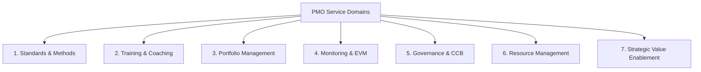

# PMO Standard Services Matrix

**Ref ID:** PMO-SERVICES  
**Type:** FocusArea  
**PMBOK8 Source:** PMBOK 8 Appendix X2 · PMO Practice Guide §3  
**Version:** 1.0.0  
**Status:** Active  

---

## 1. Overview of PMO Services

A mature PMO provides a distinct catalog of **26 standard services** categorized into **7 strategic service domains**. These services are designed to eliminate project waste, improve practitioner capabilities, and ensure that investments achieve target business benefits.

---

## 2. Standard PMO Services Directory

The 26 standard services categorized across the 7 domains include:

### Domain 1: Standards and Methodologies (Core Enablement)
1. **Methodology Tailoring:** Guide project teams in choosing predictive, agile, or hybrid paths (PR04).
2. **Template Authoring:** Formulate standard forms, registers, and charter documents (A01–A41).
3. **PMIS Integration:** Administer centralized software platforms (Jira, MS Project, Smartsheet).
4. **Historical Database Admin:** Maintain past project archives and metrics databases.

### Domain 2: Competency and Capability Development (Talent Enhancement)
5. **Skill Registry Administration:** Track and manage project management skill ratings.
6. **Standard Training Delivery:** Host bootcamps on EVM, risk planning, and agile methodologies.
7. **One-on-One PM Mentoring:** Assign senior PMs to coach junior coordinators.
8. **Career Development Mapping:** Design career pathways for project practitioners.

### Domain 3: Portfolio Management (Strategic Alignment)
9. **Strategic Prioritization:** Host workshops to rate project scores against corporate strategic goals.
10. **Dependency Analysis:** Map cross-project constraints and schedule bottlenecks.
11. **Investment Planning:** Align project budgets with capital investment guidelines.
12. **Capacity Forecasting:** Estimate future talent capacity limits across the enterprise.

### Domain 4: Project/Program Performance Monitoring (Variance Management)
13. **Earned Value Reporting:** Aggregate EVM metrics (CV, SV, CPI, SPI) to predict portfolio completions.
14. **Risk Reviews & Audits:** Moderates detailed qualitative risk sessions and simulates reserves (PR24).
15. **Quality Inspections:** Conducts independent reviews of verified deliverables (`PR37`).
16. **Milestone Verification:** Confirms that transition deliverables satisfy client acceptance tests.

### Domain 5: Governance and Compliance (Oversight Control)
17. **Change Control Board (CCB) Administration:** Facilitates formal baseline modification votes (`PR31`).
18. **Phase Gate Auditing:** Coordinates formal investment reviews before releasing funding stages.
19. **Regulatory Compliance Review:** Audits adherence to safety, environmental, or data laws.
20. **Audit Log Administration:** Manages change logs and decision logs.

### Domain 6: Resource Management (Optimization)
21. **Resource Leveling Assistance:** Run algorithms to balance workloads and reduce developer burnout.
22. **Niche Talent Acquisition:** Guide functional hiring managers in procuring contract staff.
23. **Cross-Project Expert Sharing:** Coordinate temporary technical allocations between teams.

### Domain 7: Strategic Value Enablement (Outcomes Realization)
24. **Business Case Auditing:** Review financial projections before project charter release (`PR01`).
25. **Benefits Realization Logging:** Track performance outcomes post-delivery to verify strategic value.
26. **Central Knowledge Management:** Manage repository OPAs and lessons learned.

---

## 3. Service Maturity Levels (1–5 Scale)

For each of the 26 services, a PMO operates at a specific level of maturity:

| Level | Maturity Stage | Standard Service Behavior |
|---|---|---|
| **Level 1** | **Ad-hoc** | Services are performed occasionally in response to crises. No standard processes exist. |
| **Level 2** | **Defined** | Core templates and simple rules exist. The PMO acts as a supportive repository. |
| **Level 3** | **Managed** | Services are standard, standardized, and monitored. Compliance checks are enforced. |
| **Level 4** | **Measured** | Quantitative metrics track service quality. EVM and risk models are integrated. |
| **Level 5** | **Optimized** | Continuous improvement is automated. AI and predictive tools optimize portfolio resource flows. |

---

*Authority: PMBOK8 Guide Appendix X2 · PMO Practice Guide §3*
