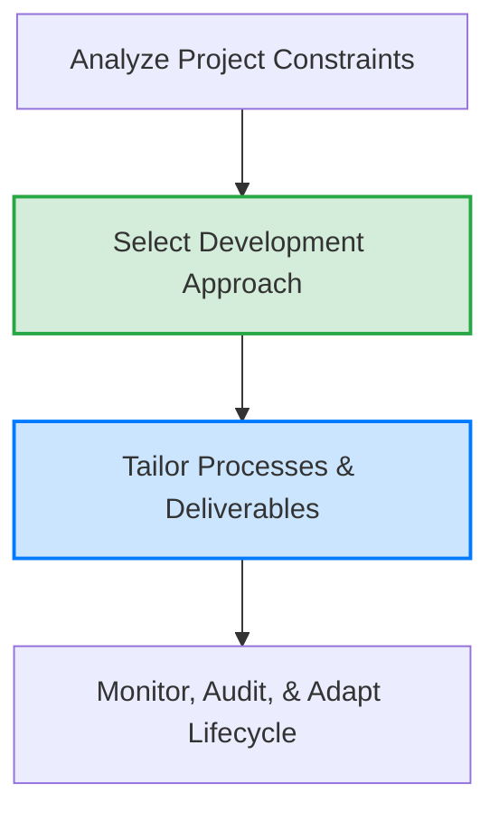

# Tailoring Guidance Master Index

**Ref ID:** TAILOR-INDEX  
**Type:** FocusArea  
**PMBOK8 Source:** PMBOK 8 Core Standard §3 · PMBOK 8 Guide §3  
**Version:** 1.0.0  
**Status:** Active  

---

## 1. What is Tailoring?

In the PMBOK 8th Edition framework, **Tailoring** is the conscious adaptation of the project development approach, lifecycles, processes, and artifacts to suit the specific environment, complexity, size, risk profile, and organizational culture of a project. Because "one size does not fit all," tailoring ensures that project management overhead is directly aligned with the value delivery potential of the initiative.

---

## 2. The Four Tailoring Levels (T1–T4 Routing)

Project routing is determined by project complexity, budget size, regulatory impact, and stakeholder diversity as detailed in `AUTHORITY-ROUTING.md`:

| Level | Complexity Tier | Governance Path | PMIS / Document Requirements |
|---|---|---|---|
| **T1** | **Low Complexity** | PM Discretionary / Supportive PMO | Minimal stubs, simple tracking sheets, rapid execution cycles. |
| **T2** | **Medium Complexity** | CCB Administered / Controlling PMO | Core baselines, standardized templates, active change control log. |
| **T3** | **High Complexity** | Portfolio Director / EPMO Approved | Detailed multi-point plans, extensive audits, formal CCB. |
| **T4** | **Strategic / Enterprise** | Executive Sponsor / Board Audited | Deep regulatory checklists, extensive reserves, external validations. |

---

## 3. The Tailoring Process Lifecycle

Tailoring is not a one-time startup task; it is a continuous, iterative cycle:

1. **Identify Elicitation Factors:** Assess project complexity factors (skills availability, remote team footprint, technology maturity).
2. **Select Initial Approach:** Choose predictive, agile, or hybrid methods (see [tailoring-approaches.md](./tailoring-approaches.md)).
3. **Tailor Processes & Forms:** Customize the inputs, tools, techniques, and forms to eliminate waste.
4. **Monitor and Adapt:** Periodically audit performance during execution gates and sprints to adjust the tailoring choices as complexity shifts.

---

## 4. Tailoring Guidance Directory

Navigate the specific tailoring considerations for each PMBOK 8 Performance Domain using these dedicated guides:

*   [Governance Tailoring](./tailoring-governance.md) — Customizing the PMO services, CCB structures, and authority levels.
*   [Scope Tailoring](./tailoring-scope.md) — Customizing WBS structures, requirements gathering, and verification gates.
*   [Schedule Tailoring](./tailoring-schedule.md) — Adjusting estimating models, network sequencing, and scheduling sprints.
*   [Finance Tailoring](./tailoring-finance.md) — Customizing funding limits, contingency modeling, and EVA frequencies.
*   [Stakeholder Tailoring](./tailoring-stakeholders.md) — Adjusting communications, collaboration platforms, and feedback loops.
*   [Resource Tailoring](./tailoring-resources.md) — Adapting resource assignments, training models, and procurement sourcing.
*   [Risk Tailoring](./tailoring-risk.md) — Adjusting qualitative vs. quantitative risk models and contingency reserve sizing.
*   [Approaches Tailoring Guide](./tailoring-approaches.md) — Decision matrix comparing predictive, agile, and hybrid development frameworks.

---

*Authority: PMBOK8 Core Standard §3 · PMOSkills Repository*
