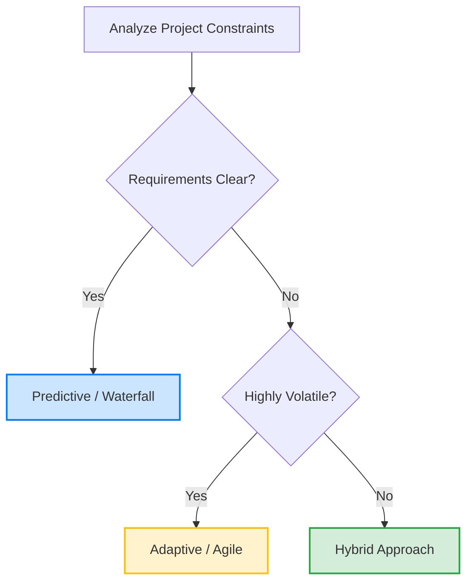

# Development Approaches Tailoring Guide

**Ref ID:** TAILOR-APP  
**Type:** FocusArea  
**PMBOK8 Source:** PMBOK 8 Development Approach and Life Cycle Performance Domain  
**Version:** 1.0.0  
**Status:** Active  

---

## 1. Development Approaches Compared

Project Managers must select a development approach that aligns with project stability, requirements clarity, deliverable type, and resource constraints:

| Parameter | Predictive (Waterfall) | Adaptive (Agile) | Hybrid (Blended) |
|---|---|---|---|
| **Requirements** | Locked down, clear from start | Evolving, emergent, volatile | Mixed: locked core, agile UI |
| **Change Frequency** | Low (CCB audited) | Very High (sprint backlogs) | Medium (controlled phases) |
| **Risk Level** | High (delayed verification) | Low (early sprint testing) | Medium (managed gates) |
| **Deliverable Type** | Single final release | Continuous value increments | Staged releases |
| **Primary Metric** | Conformance to plan/budget | Customer value realized | Balanced milestone delivery |

---

## 2. Decision Matrix: PMBOK 8 Elicitation Factors

Use this scoring framework to choose your optimal development approach:

### 2.1 Product & Deliverable Factors
* **Degree of Innovation:** If the product is highly novel/R&D, score towards **Adaptive**. If familiar (repeating past work), score towards **Predictive**.
* **Requirements Stability:** High stability scores **Predictive**; rapid changes score **Adaptive**.
* **Deliverable Type:** Physical infrastructure scores **Predictive**; software or design scores **Adaptive**.

### 2.2 Project & Environment Factors
* **Market Dynamics:** Highly volatile commercial competition scores **Adaptive** to allow pivot agility.
* **Funding Limits:** Fixed, strict funding grants score **Predictive**; variable stream funding scores **Adaptive**.

### 2.3 Organizational & Team Factors
* **Team Skill Level:** Experienced agile teams score **Adaptive**; traditional functional teams score **Predictive**.
* **PMO Maturity:** Supportive, flexible PMOs facilitate **Hybrid/Adaptive** models.
* **Corporate Culture:** Structured, bureaucratic systems usually mandate **Predictive/Hybrid** gates.

---

## 3. Scenario Integration (Meridian CRM System Upgrade)

The *Meridian CRM System Upgrade* project is a classic case for **Hybrid Development Tailoring**.
* **Agile Tracks Tailored:** The user interface design, reporting dashboards, and client testing were executed using 2-week agile sprints to gather rapid customer feedback.
* **Waterfall Tracks Tailored:** The core database schema migration, multi-system API integration, and security compliance verification were managed predictive/waterfall milestones due to high regulatory risk and legacy system stability needs.
* **Outcome:** This hybrid tailoring successfully delivered a modern, user-friendly interface while guaranteeing 100% security compliance and database stability at launch.

---

## 4. Approach Tailoring Checklist

Before locking down your development approach in the Project Management Plan (`PR03`), verify these decisions:

- [ ] **Is the deliverable decomposable?** If the final product can be split into standalone functional increments, select an adaptive or hybrid model to release value early.
- [ ] **Are resources dedicated?** Adaptive models require dedicated, cross-functional team members; if resources are highly shared, select a hybrid/predictive milestone model.
- [ ] **How is quality verified?** Define whether quality checks occur at major stage-gates (predictive) or continuously at the end of each sprint cycle (adaptive).
- [ ] **Has the sponsor agreed to the model?** Ensure that the executive sponsor understands that adaptive models focus on velocity and backlog priority rather than rigid fixed-scope baselines.

---

*Authority: PMBOK8 Guide §2.3 · Agile Practice Guide §3*
