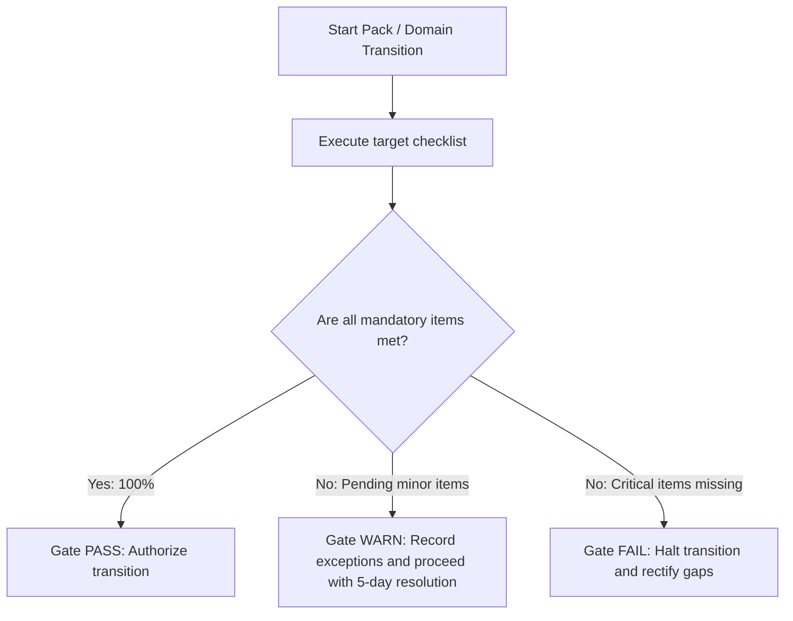

# shared/checklists/index.md — Checklist Catalog
**Status:** Active
**Version:** 1.0.0
**Authority:** Repo Operating Rules · SKILL-REGISTRY.md
**File Path:** `shared/checklists/index.md`

---

## Purpose

The `shared/checklists/` directory contains structured, actionable checklists that verify phase, pack, and domain readiness. These checklists ensure that all prerequisite skills have been successfully executed and all required artifacts are complete and approved before project work transitions to a downstream phase or domain.

---

## Checklist Index

### Pack Readiness Checklists
These checklists verify that a project is ready to enter a specific execution pack (Packs 01–07).

| Checklist | File Path | Scope / Phase Gate Target |
|-----------|-----------|---------------------------|
| **Pack 01 Readiness** | [`pack-readiness/pack-01-readiness.md`](./pack-readiness/pack-01-readiness.md) | Organizational Setup Ready |
| **Pack 02 Readiness** | [`pack-readiness/pack-02-readiness.md`](./pack-readiness/pack-02-readiness.md) | Initiating Phase Entry |
| **Pack 03 Readiness** | [`pack-readiness/pack-03-readiness.md`](./pack-readiness/pack-03-readiness.md) | Planning Phase Entry |
| **Pack 04 Readiness** | [`pack-readiness/pack-04-readiness.md`](./pack-readiness/pack-04-readiness.md) | Executing Phase Entry |
| **Pack 05 Readiness** | [`pack-readiness/pack-05-readiness.md`](./pack-readiness/pack-05-readiness.md) | Monitoring & Controlling Phase Entry |
| **Pack 06 Readiness** | [`pack-readiness/pack-06-readiness.md`](./pack-readiness/pack-06-readiness.md) | Closing Phase Entry |
| **Pack 07 Readiness** | [`pack-readiness/pack-07-readiness.md`](./pack-readiness/pack-07-readiness.md) | Adaptive & Hybrid Lifecycle Readiness |

### Domain Readiness Checklists
These checklists verify deep capability alignment within key performance domains.

| Checklist | File Path | Focus Area |
|-----------|-----------|------------|
| **Scope Readiness** | [`domain-checklists/scope-readiness.md`](./domain-checklists/scope-readiness.md) | Scope baselines & requirement validation |
| **Schedule Readiness** | [`domain-checklists/schedule-readiness.md`](./domain-checklists/schedule-readiness.md) | Schedule network integrity & baseline readiness |
| **Risk Readiness** | [`domain-checklists/risk-readiness.md`](./domain-checklists/risk-readiness.md) | Qualitative/quantitative risk alignment |
| **Closure Readiness** | [`domain-checklists/closure-readiness.md`](./domain-checklists/closure-readiness.md) | Handovers, operational sign-off & archiving |

---

## Standard Verification Protocol

---

*Authority: PMBOK8 Governance Performance Domain §2.1 · PMOSkills Repository*
*Last Updated: 2026-06-02 · Initial Release*
