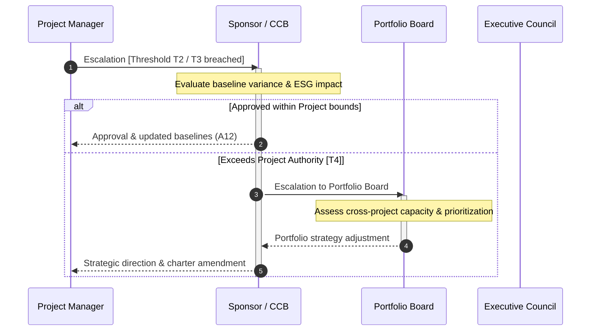

# shared/routing/escalation-paths.md — Decision Escalation Paths
**Status:** Active
**Version:** 1.0.0
**Authority:** AUTHORITY-ROUTING.md · PMBOK8 Governance Performance Domain §2.1
**File Path:** `shared/routing/escalation-paths.md`

---

## Purpose

This document outlines formal escalation procedures and RACI matrices when a project variance, issue, or change request exceeds the local threshold of the delivery team. It bridges the gap between project delivery execution and enterprise portfolio management, ensuring quick, transparent resolution of blocking issues.

---

## Escalation Path Map

---

## Decision Escalation Protocols

### 1. Operational-to-Controlled (T1 → T2)
*   **Trigger:** Projected variance exceeds 5% of cost or 5 days of schedule, or requires a vendor contract adjustment.
*   **Action Pathway:** PM prepares Change Request (CR) using `A12Change Log` template. routes CR to designated CCB or Sponsor.
*   **Resolution Target:** 3 business days.

### 2. Controlled-to-Governance (T2 → T3)
*   **Trigger:** Projected variance exceeds 10% of cost or 15 days of schedule, or alters business case assumptions in A01.
*   **Action Pathway:** PM escalates the CR to the main Project Governing Body (Sponsor and Executive representatives).
*   **Resolution Target:** 5 business days.

### 3. Governance-to-Enterprise (T3 → T4)
*   **Trigger:** Decision involves shared-resource contention with another high-priority initiative, or changes enterprise PMO methodology standards.
*   **Action Pathway:** Sponsor or PMO Leader routes the decision to the OPM Board or Portfolio Board.
*   **Resolution Target:** 10 business days.

---

## Escalation RACI Reference

| Decision Type | Project Manager | Project Sponsor | PMO Leader | Portfolio Board |
|---|---|---|---|---|
| **T1 Operational** | **A** / **R** | **I** | **C** | **I** |
| **T2 Controlled Change** | **R** | **A** | **C** | **I** |
| **T3 Governance Change** | **R** | **A** | **C** | **C** |
| **T4 Enterprise Portfolio**| **I** | **C** | **C** | **A** / **R** |

*R = Responsible · A = Accountable · C = Consulted · I = Informed*

---

*Authority: PMBOK8 Governance Performance Domain §2.1 · PMOSkills Repository*
*Last Updated: 2026-06-02 · Initial Release*
