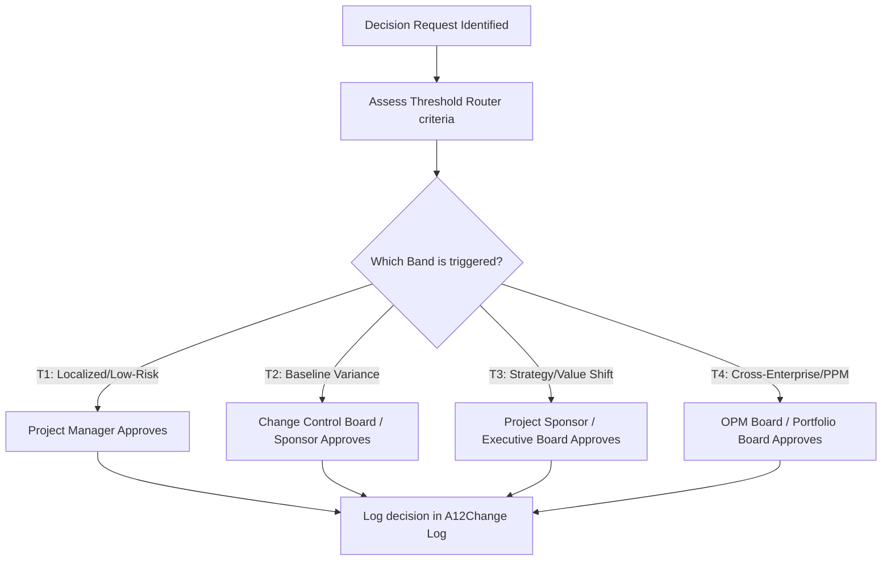

# shared/routing/index.md — Decision Routing Catalog
**Status:** Active
**Version:** 1.0.0
**Authority:** AUTHORITY-ROUTING.md · PMBOK8 Governance Performance Domain §2.1
**File Path:** `shared/routing/index.md`

---

## Purpose

The `shared/routing/` directory contains modular decision-routing components that formalize project authority, escalation pathways, and stakeholder consultation rules. This catalog enables project managers, AI agents, and PMO analysts to consistently route decision requests to the appropriate authority band (T1–T4) based on qualitative and quantitative risk indicators.

---

## Routing Component Index

| Component | File Path | Primary Function |
|-----------|-----------|------------------|
| **Threshold Router** | [`threshold-router.md`](./threshold-router.md) | Maps a decision's attributes to its T1, T2, T3, or T4 authority band based on baseline impacts and risk profiles. |
| **Escalation Paths** | [`escalation-paths.md`](./escalation-paths.md) | Defines the step-by-step escalation procedures and RACI assignments when a decision exceeds local tolerances. |

---

## Core Routing Workflow

---

## Governance Standards Integration

This routing catalog is a key element of the **PMO Governance Model**, integrating direct references to:
- **`AUTHORITY-ROUTING.md`**: The master directory of artifact decision accountabilities.
- **`QUALITY-STANDARDS.md`**: Quality gates governing phase transitions.
- **`reference/pmo/pmo-services.md`**: Services mapped to organizational and PMO maturity levels.

---

*Authority: PMBOK8 Governance Performance Domain §2.1 · PMOSkills Repository*
*Last Updated: 2026-06-02 · Initial Release*
