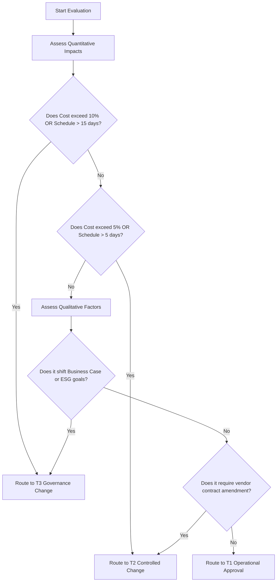

# shared/routing/threshold-router.md — Threshold Decision Router
**Status:** Active
**Version:** 1.0.0
**Authority:** AUTHORITY-ROUTING.md · PMBOK8 §3.5 Be an Accountable Leader
**File Path:** `shared/routing/threshold-router.md`

---

## Purpose

The **Threshold Router** provides a deterministic classification framework for mapping any proposed change, variance, or issue to its corresponding authority band. By evaluating specific qualitative and quantitative limits, it prevents unapproved scope creep, ensures regulatory compliance, and protects overall project value.

---

## The Classification Matrix

| Threshold Band | Impact Limits (Quantitative) | Risk / Scope Factors (Qualitative) | Default Authority |
|---|---|---|---|
| **T1 Operational** | Cost variance < 5%   Schedule variance < 5 days   Contingency spend < $10k | - Localized task adjustment - No change to baselined requirements - No change to vendor contracts | **Project Manager** (or delegated lead) |
| **T2 Controlled Change**| Cost variance 5% - 10%   Schedule variance 5 - 15 days   Contingency spend $10k - $50k | - Modifies secondary artifact requirements - Requires amendment of active vendor contract - Triggers moderate ESG metric variations | **Change Control Board (CCB)** or Sponsor-delegated board |
| **T3 Governance Change**| Cost variance > 10%   Schedule variance > 15 days   Contingency spend > $50k | - Cross-baseline impacts (Cost + Scope) - Alters value assumptions in Business Case (A01) - Materially shifts ESG/Sustainability goals | **Project Sponsor** or Governing Body |
| **T4 Enterprise Portfolio**| Cross-initiative budget shift   Enterprise resource contention | - Changes organizational governance policies - Affects multi-project shared-capacity - Strategic alignment redirection | **Portfolio Board** or Executive Council |

---

## Routing Evaluation Flowchart

---

## Router Execution Protocol

1. **Step 1: Metric Identification** — Measure the projected delta in cost, time, scope, or expected value.
2. **Step 2: Worst-Case Mapping** — Match the delta against the criteria above. If a decision triggers a T2 cost impact but a T3 risk impact, the decision **must** be escalated to the highest matching band (**T3**).
3. **Step 3: Document and Audit** — Log the decision pathway in `A12Change Log` and reference the router criteria applied.

---

*Authority: PMBOK8 Standard §3.5 · PMOSkills Repository*
*Last Updated: 2026-06-02 · Initial Release*
