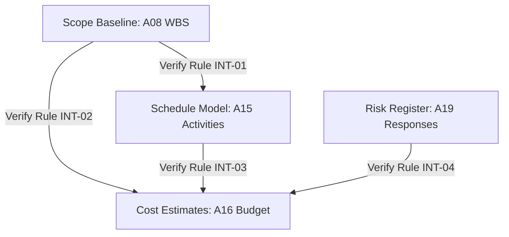

# shared/validators/baseline-integrity-check.md — Baseline Integrity Validator
**Status:** Active
**Version:** 1.0.0
**Authority:** PMBOK8 Principle 5 (§3.3 Systems Thinking) · Principle 8 (§3.4 Embed Quality)
**File Path:** `shared/validators/baseline-integrity-check.md`

---

## Purpose

The **Baseline Integrity Validator** is a systems-thinking audit designed to verify consistency across the core project baselines: Scope (A08), Schedule (A15), Cost (A16), and Risk (A19). It ensures that every work package defined in the Scope baseline maps directly to schedule activities, cost estimates, and risk triggers, preventing orphaned deliverables or hidden budget items.

---

## Cross-Baseline Integrity Rules

| Rule ID | Integrity Target | Audit Parameter Description | Target Verification |
|---|---|---|---|
| **INT-01** | WBS to Schedule | Every level-3 Work Package in the WBS (`A08 §4.1`) must map to at least one active schedule activity in the Schedule Model (`A15`). | 100% WBS-to-Schedule mapping |
| **INT-02** | WBS to Cost | Every Work Package in the WBS (`A08 §4.2`) must contain an associated financial cost estimate in Cost Estimates (`A16`). | 100% WBS-to-Cost mapping |
| **INT-03** | Schedule to Cost| Total baseline effort hours in Schedule (`A15`) multiplied by resource rates must reconcile within 10% of Cost baseline totals (`A16`). | Reconciles within ± 10% |
| **INT-04** | Risks to Cost | Risk response plans in the Risk Register (`A19`) requiring funding must map to an active Management Reserve allocation in Cost Baseline (`A16`). | 100% funded contingency mappings |

---

## Evaluation Workflow Diagram

---

## Evaluation Results Logic

### Deterministic Output Criteria

*   **PASS (All 4 Rules verified):** Full baseline integrity achieved. The Project Management Plan (A14) is ready to be baselined.
*   **WARN (3 / 4 verified):** Slight discrepancy in INT-03 (Schedule-to-Cost variance is 10% - 15%) or INT-04 (Risk reserve is pending authorization). **Condition:** Approving authority must document and sign off on variance before proceeding.
*   **FAIL (< 3 verified OR failure of Rule INT-01 or INT-02):** Unmapped deliverables or unestimated work packages detected. **Condition:** Reject baseline and halt project gate transition.

---

*Authority: PMBOK8 Standard §3.3 · PMOSkills Repository*
*Last Updated: 2026-06-02 · Initial Release*
