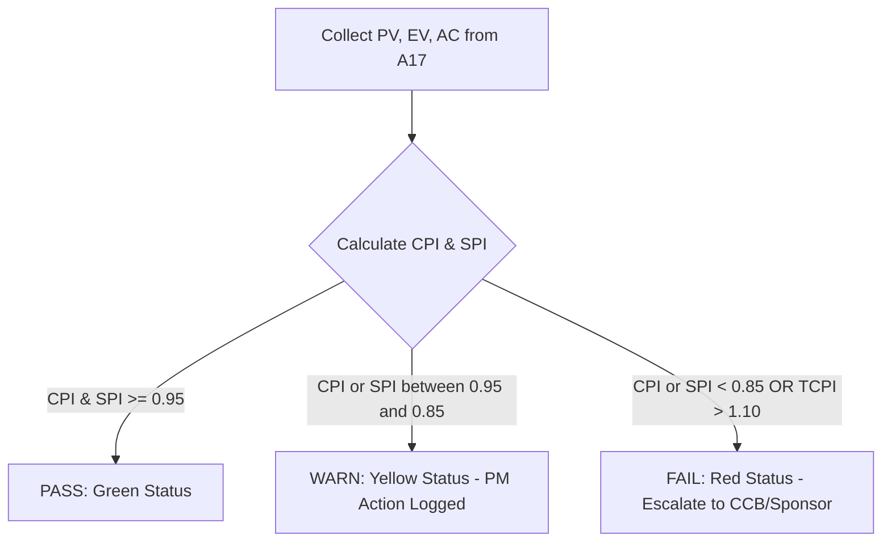

# shared/validators/evm-threshold-validator.md — EVM Threshold Validator
**Status:** Active
**Version:** 1.0.0
**Authority:** PMBOK8 Measurement Performance Domain · EVM Practice Standard (REF-16)
**File Path:** `shared/validators/evm-threshold-validator.md`

---

## Purpose

The **EVM Threshold Validator** defines the quantitative control limits, performance variance boundaries, and forecasting rules used by the PMO to monitor project financial health, schedule progress, and recovery feasibility. It provides the mathematical rules for interpreting Earned Value metrics (PV, EV, AC) and enforcing corrective action triggers.

---

## Quantitative EVM Threshold Rules

```yaml
evm_thresholds:
  spi_warning: 0.95
  spi_critical: 0.85
  cpi_warning: 0.95
  cpi_critical: 0.85
  eac_variance_threshold_percent: 10.0
  tcpi_alert: 1.10
```

| Metric ID | Performance Indicator | Warning Threshold | Critical Threshold (Action Required) | PMO Enforcement Protocol |
|---|---|---|---|---|
| **EVM-SPI** | Schedule Performance Index (SPI) | `< 0.95` | `< 0.85` | Critical SPI requires a formal schedule recovery plan (`PR34`) and resource reallocation. |
| **EVM-CPI** | Cost Performance Index (CPI) | `< 0.95` | `< 0.85` | Critical CPI triggers an immediate root cause analysis (`PR35`) and budget variance escalation to CCB (`PR31`). |
| **EVM-EAC** | Estimate at Completion (EAC) Variance | `> 5.0%` | `> 10.0%` of Budget at Completion (BAC) | Critical EAC variance requires a formal Baseline Change Request (`A12`) to adjust funding/contingency reserves. |
| **EVM-TCPI** | To-Complete Performance Index (TCPI) | `> 1.05` | `> 1.10` (Targeting BAC) | TCPI > 1.10 indicates recovery to BAC is statistically unfeasible. Requires re-baselining to EAC. |

---

## Earned Value Calculations Reference

The following formulas must be implemented by PMO reporting algorithms:

1. **Schedule Variance (SV):** `SV = EV - PV`
2. **Cost Variance (CV):** `CV = EV - AC`
3. **Schedule Performance Index (SPI):** `SPI = EV / PV`
4. **Cost Performance Index (CPI):** `CPI = EV / AC`
5. **Estimate at Completion (EAC):**
   * *Typical Variance:* `EAC = BAC / CPI`
   * *Atypical Variance:* `EAC = AC + (BAC - EV)`
6. **Estimate to Complete (ETC):** `ETC = EAC - AC`
7. **To-Complete Performance Index (TCPI):** `TCPI = (BAC - EV) / (BAC - AC)`

---

## Evaluation Workflow Diagram



---

## Evaluation Results Logic

### Deterministic Output Criteria

*   **PASS (Green):** CPI >= 0.95 AND SPI >= 0.95 AND TCPI <= 1.05. Project is performing within acceptable control tolerances.
*   **WARN (Yellow):** CPI or SPI is between 0.85 and 0.95, or TCPI is between 1.05 and 1.10. PM must document the variance in the Status Report (A17) and outline a recovery path in the Issue Log (A18).
*   **FAIL (Red):** CPI < 0.85 OR SPI < 0.85 OR EAC variance exceeds 10% of BAC, OR TCPI > 1.10. Triggers automatic PMO audit, blocks next phase gate approval, and requires CCB action to re-baseline.

---

*Authority: PMBOK8 Measurement Performance Domain · EVM Practice Standard (REF-16)*
*Last Updated: 2026-06-07 · Initial Release*
