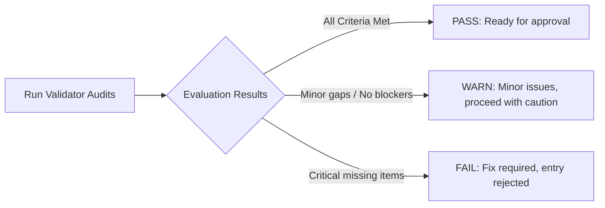

# shared/validators/index.md — Validator Catalog
**Status:** Active
**Version:** 1.0.0
**Authority:** QUALITY-STANDARDS.md §7.5 Phase 5 gate
**File Path:** `shared/validators/index.md`

---

## Purpose

The `shared/validators/` directory contains standard audit and verification checklists designed to validate project deliverables, baselines, and resource use. These validators act as automated quality gates, ensuring that project outputs are complete, consistent, and free of waste before being submitted for formal sponsor approval.

---

## Validator Catalog

| Validator | File Path | Primary Audit Target |
|-----------|-----------|----------------------|
| **Waste Test** | [`waste-test.md`](./waste-test.md) | Detects lean waste categories (overproduction, waiting, defects, underutilized talent) in delivery processes. |
| **Artifact Quality Check** | [`artifact-quality-check.md`](./artifact-quality-check.md) | Audits artifacts for completeness, metadata standards, and schema compliance. |
| **Baseline Integrity Check**| [`baseline-integrity-check.md`](./baseline-integrity-check.md) | Verifies cross-baseline consistency (Scope WBS links to schedule baseline and cost baseline). |
| **EVM Threshold Validator** | [`evm-threshold-validator.md`](./evm-threshold-validator.md) | Defines the quantitative control limits, performance variance boundaries, and forecasting rules for Earned Value Management. |

---

## Evaluation Workflow

Every validator produces a deterministic output using three standardized result bands:

---

## Execution Standards

1. **Self-Audit Requirement** — The project manager or skill owner **must** run the relevant validator prior to changing any artifact status from `Draft` to `Approved`.
2. **Standard Output Logging** — The validation result (PASS, WARN, or FAIL), the date of the audit, and any outstanding correction items must be recorded in the artifact's change control section.

---

*Authority: QUALITY-STANDARDS.md §7.5 · PMOSkills Repository*
*Last Updated: 2026-06-02 · Initial Release*
