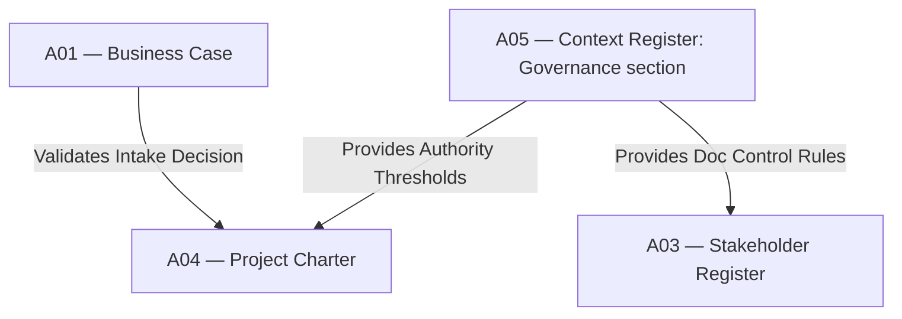

# IT-01 — Organizational Setup to Initiating Integration Test
**Status:** Active
**Version:** 1.0.0
**Authority:** QUALITY-STANDARDS.md §7.5 Phase 6 gate
**File Path:** `tests/integration-tests/IT-01-setup-to-initiating.md`

---

## Purpose

This integration test verifies that the organizational governance structures established in **Pack 01 (Organizational Setup)** successfully hand over and authorize project-level initiating activities in **Pack 02 (Initiating)**.

---

## Lifecycle Phase Mapping

This test validates the transition between two lifecycle phases:
1. **Organizational Setup (Pack 01):** Strategic governance and repository provisioning.
2. **Initiating (Pack 02):** Project Chartering and Stakeholder Identification.

---

## Core Artifact Flow Traceability

---

## Test Cases

### Test Case 1: Charter Validation against Governance Authority
*   **Scenario:** Verify that the PM authority thresholds documented in Project Charter (A04) match the organizational standards defined in Context Register (A05).
*   **Input:**
    *   `A05 §2.1` PM cost tolerance threshold = `$50,000`
    *   `A04 §4.2` Proposed Project Charter with PM variance limit = `$50,000`
*   **Expected Output:** Validation returns `PASS` status.
*   **Pass Criteria:** Charter cost tolerance is exactly equal to or less than the governance standard.
*   **Failure Cases:** If Charter variance limit is set to `$100,000` without approved tailoring exception.
*   **Authority Check:** PMO Director verifies baseline thresholds.

### Test Case 2: Document Index Number Allocation
*   **Scenario:** Verify that the Stakeholder Register is created with an ID formatting standard matching the document control standards.
*   **Input:**
    *   `A05 §3.1` Document control convention is set to `A-NN` prefix
    *   New Stakeholder Register created with ID `A03`
*   **Expected Output:** Validates ID string match.
*   **Pass Criteria:** ID conforms to `^A\d{2}$`.
*   **Failure Cases:** Register has ID `STAKEHOLDER-REGISTER` or `A-NEW-03`.
*   **Authority Check:** Lead PM conducts quality audit.

### Test Case 3: Missing Business Case block
*   **Scenario:** Verify that a Project Charter cannot be baselined if a valid, approved Business Case (A01) does not exist in the planning directory.
*   **Input:**
    *   `A01` is missing or is marked as `Draft` status.
    *   `A04` is submitted for review.
*   **Expected Output:** Validation fails with blocker warning.
*   **Pass Criteria:** Gate rejects the transition from Pack 01 to Pack 02.
*   **Failure Cases:** Project Charter is approved despite missing Business Case.
*   **Authority Check:** Project Sponsor rejects submission.

---

*Authority: PMBOK8 Integration Management Domain · PMOSkills Repository*
