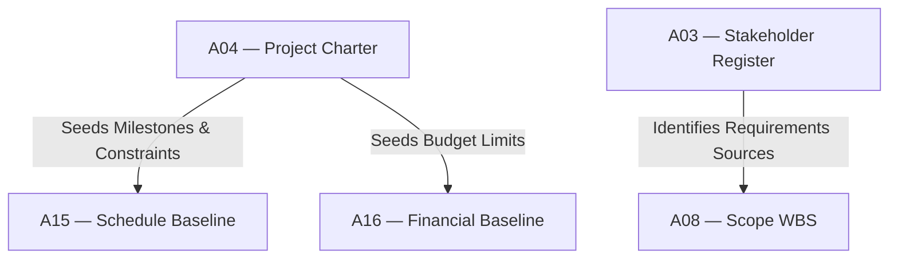

# IT-02 — Initiating to Planning Integration Test
**Status:** Active
**Version:** 1.0.0
**Authority:** QUALITY-STANDARDS.md §7.5 Phase 6 gate
**File Path:** `tests/integration-tests/IT-02-initiating-to-planning.md`

---

## Purpose

This integration test verifies that the strategic goals, milestones, and constraints defined in **Pack 02 (Initiating)** successfully seed the detailed schedule, cost, scope, and risk baselines in **Pack 03 (Planning)**.

---

## Lifecycle Phase Mapping

This test validates the transition between two lifecycle phases:
1. **Initiating (Pack 02):** Charter and stakeholder boundaries established.
2. **Planning (Pack 03):** Detailed baseline management plans built and aligned.

---

## Core Artifact Flow Traceability

---

## Test Cases

### Test Case 1: Milestone and Schedule Constraint Check
*   **Scenario:** Verify that the high-level milestones in the Project Charter (A04) constrain the detailed schedule model (A15).
*   **Input:**
    *   `A04 §3.2` Milestone "Phase 1 Complete" target date = `2026-09-01`
    *   `A15 §4.1` Detailed schedule finish date for same milestone = `2026-08-25`
*   **Expected Output:** Validation returns `PASS`.
*   **Pass Criteria:** Detailed schedule activity dates do not violate high-level charter limits.
*   **Failure Cases:** Detailed activity date exceeds charter target date (e.g. `2026-09-05`).
*   **Authority Check:** Project Manager and Sponsor review schedule.

### Test Case 2: Stakeholder Requirements Verification
*   **Scenario:** Verify that requirements mapped in the WBS (A08) trace back only to active stakeholders listed in Stakeholder Register (A03).
*   **Input:**
    *   `A08 §1.1` WBS requirements linked to owner = `SH-005`
    *   `A03 §2.0` Stakeholder record `SH-005` exists in database
*   **Expected Output:** Traceability validation returns `PASS`.
*   **Pass Criteria:** 100% of requirements map to valid stakeholders.
*   **Failure Cases:** Requirement references a stakeholder ID not found in A03.
*   **Authority Check:** Scope Lead sign-off.

### Test Case 3: Charter Cost Cap Constraint
*   **Scenario:** Verify that the detailed financial budget (A16) does not exceed the high-level budget cap defined in the charter (A04).
*   **Input:**
    *   `A04 §2.2` Charter approved cost cap = `$500,000`
    *   `A16 §3.0` Cumulative budget line-items = `$495,000` (including contingency reserves)
*   **Expected Output:** Budget validation returns `PASS`.
*   **Pass Criteria:** Detailed baseline cost is less than or equal to the Charter cost cap.
*   **Failure Cases:** Detailed cost baseline equals `$510,000` (exceeds cap).
*   **Authority Check:** Project Sponsor and CCB.

---

*Authority: PMBOK8 Integration Management Domain · PMOSkills Repository*
