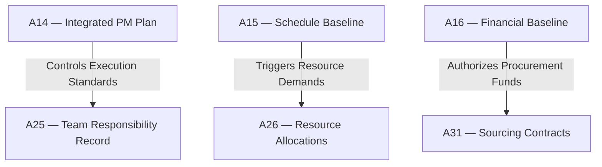

# IT-03 — Planning to Executing Integration Test
**Status:** Active
**Version:** 1.0.0
**Authority:** QUALITY-STANDARDS.md §7.5 Phase 6 gate
**File Path:** `tests/integration-tests/IT-03-planning-to-executing.md`

---

## Purpose

This integration test verifies that the approved baselines and planning blueprints created in **Pack 03 (Planning)** successfully transition into active physical execution and resource deployment in **Pack 04 (Executing)**.

---

## Lifecycle Phase Mapping

This test validates the transition between two lifecycle phases:
1. **Planning (Pack 03):** Detailed WBS, schedule, cost, and risk baselines locked.
2. **Executing (Pack 04):** Directing work, resource acquisition, team development, and vendor procurement.

---

## Core Artifact Flow Traceability

---

## Test Cases

### Test Case 1: Resource Acquisition against Schedule Timeline
*   **Scenario:** Verify that actual resource acquisition timelines in A26 support the planned activity start dates defined in the schedule baseline (A15).
*   **Input:**
    *   `A15 §2.2` Task "System Migration" scheduled start date = `2026-10-01`
    *   `A26 §1.2` Resource "System Architect" onboarded target date = `2026-09-28`
*   **Expected Output:** Validation returns `PASS`.
*   **Pass Criteria:** Onboarding occurs on or before the task start date.
*   **Failure Cases:** Onboarding date is set to `2026-10-05` (creates schedule slip).
*   **Authority Check:** Resource Manager and Project Manager.

### Test Case 2: Procurement Contract cost validation
*   **Scenario:** Verify that purchase orders and vendor agreements in A31 match or are below the authorized budget lines in A16.
*   **Input:**
    *   `A16 §2.0` Work Package budget code `WP-402` allocated funds = `$120,000`
    *   `A31 §3.1` Vendor contract price under code `WP-402` = `$115,000`
*   **Expected Output:** Validation returns `PASS`.
*   **Pass Criteria:** Vendor contract price is within allocated budget limits.
*   **Failure Cases:** Vendor contract price is `$135,000` without approved budget variance from CCB.
*   **Authority Check:** Procurement Manager and Project Sponsor.

### Test Case 3: Team operating agreement RACI alignment
*   **Scenario:** Verify that the team responsibilities documented in A25 do not violate the overall governance authority rules from planning.
*   **Input:**
    *   `A05 §2.1` PM is Accountable (A) for scope change validation
    *   `A25 §1.1` Team member `TM-002` is mistakenly marked as Accountable (A) for scope changes
*   **Expected Output:** Validation fails due to RACI violation.
*   **Pass Criteria:** 100% of RACI accountability maps to authorized governance roles.
*   **Failure Cases:** A non-authorized team role is marked as Accountable for governance decisions.
*   **Authority Check:** PMO Leader rejects the team agreement.

---

*Authority: PMBOK8 Integration Management Domain · PMOSkills Repository*
