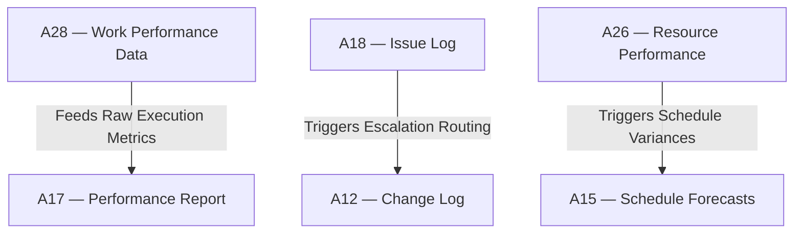

# IT-04 — Executing to Monitoring & Controlling Integration Test
**Status:** Active
**Version:** 1.0.0
**Authority:** QUALITY-STANDARDS.md §7.5 Phase 6 gate
**File Path:** `tests/integration-tests/IT-04-executing-to-mc.md`

---

## Purpose

This integration test verifies that the real-world metrics, actual costs, completed durations, and issues generated in **Pack 04 (Executing)** successfully feed and trigger the steering controls, variance alerts, and EVM reports in **Pack 05 (Monitoring & Controlling)**.

---

## Lifecycle Phase Mapping

This test validates the transition between two lifecycle phases:
1. **Executing (Pack 04):** Active task execution and team performance.
2. **Monitoring & Controlling (Pack 05):** Performance reporting, change logging, and baseline steering.

---

## Core Artifact Flow Traceability

---

## Test Cases

### Test Case 1: Work Performance Data EVM Calculation
*   **Scenario:** Verify that raw work performance data from execution is correctly transformed into cost and schedule performance indices (CPI and SPI) in A17.
*   **Input:**
    *   `A28 §1.1` Actual Cost (AC) = `$100,000`
    *   `A28 §1.2` Earned Value (EV) = `$90,000`
*   **Expected Output:** Validation returns `PASS` and computes index values.
*   **Pass Criteria:** `CPI = EV / AC = 0.90` is correctly logged.
*   **Failure Cases:** CPI is incorrectly calculated or remains blank.
*   **Authority Check:** Project Manager.

### Test Case 2: Issue-to-Change Log Escalation
*   **Scenario:** Verify that high-priority issues requiring baseline changes trigger corresponding change requests in the Change Log (A12).
*   **Input:**
    *   `A18 §2.0` Issue `I-005` "Server Failure" marked as `CRITICAL` requiring new capital.
    *   `A12 §1.1` Corresponding Change Request `CR-008` is created and mapped.
*   **Expected Output:** Traceability validation returns `PASS`.
*   **Pass Criteria:** Links are explicitly documented in both registers.
*   **Failure Cases:** A critical baseline-violating issue is closed without an A12 change request.
*   **Authority Check:** Change Control Board.

### Test Case 3: Waste-Test Audit Integration
*   **Scenario:** Verify that delivery process issues trigger qualitative Lean audits using the TIMWOODS waste-test validator.
*   **Input:**
    *   `A18 §3.0` Three repeat reports of "Waiting for approval" logged under code `I-012`.
    *   `waste-test.md` is executed on process PR31 (Change Control).
*   **Expected Output:** Validation returns `FAIL` on "Waiting" category, flagging bottleneck.
*   **Pass Criteria:** Validator successfully isolates and highlights process wait states.
*   **Failure Cases:** System logs wait states but waste validator returns clean pass status.
*   **Authority Check:** PMO Continuous Improvement Team.

---

*Authority: PMBOK8 Integration Management Domain · PMOSkills Repository*
