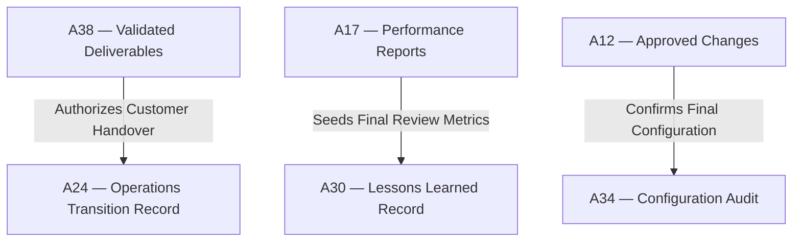

# IT-05 — Monitoring & Controlling to Closing Integration Test
**Status:** Active
**Version:** 1.0.0
**Authority:** QUALITY-STANDARDS.md §7.5 Phase 6 gate
**File Path:** `tests/integration-tests/IT-05-mc-to-closing.md`

---

## Purpose

This integration test verifies that the performance metrics, validation registers, and change resolutions completed under **Pack 05 (Monitoring & Controlling)** successfully hand over and authorize formal transition, handover, and archive activities in **Pack 06 (Closing)**.

---

## Lifecycle Phase Mapping

This test validates the transition between two lifecycle phases:
1. **Monitoring & Controlling (Pack 05):** Quality audits, scope validations, and variance tracking.
2. **Closing (Pack 06):** Deliverable sign-offs, lessons learned archiving, and benefit transitions.

---

## Core Artifact Flow Traceability

---

## Test Cases

### Test Case 1: Deliverable Validation Handoff
*   **Scenario:** Verify that only deliverables validated and signed off in control scope (A38) are included in the final customer handover package (A24).
*   **Input:**
    *   `A38 §2.0` Deliverables `D-001`, `D-002` marked as `Validated`
    *   `A38 §2.0` Deliverable `D-003` marked as `Failed Validation`
*   **Expected Output:** Handoff validation returns `PASS` on `D-001`/`D-002`, and block flag on `D-003`.
*   **Pass Criteria:** Handover transition lists only validated items; any failed item blocks close-out.
*   **Failure Cases:** Unvalidated or failed deliverables are handed over to operational client.
*   **Authority Check:** Project Manager and Client QA Lead.

### Test Case 2: Change Log Closure Audit
*   **Scenario:** Verify that the project cannot be closed if there are active, open change requests in the Change Log (A12).
*   **Input:**
    *   `A12 §1.1` Change Request `CR-014` is marked as `Pending Board Review`
    *   Project close-out wizard initiated.
*   **Expected Output:** Validation fails with open items warning.
*   **Pass Criteria:** Phase transition is blocked until status becomes `Approved` or `Rejected`.
*   **Failure Cases:** Project is closed with outstanding unapproved budget change requests.
*   **Authority Check:** PMO Board and Sponsor.

### Test Case 3: Sustainability Register (Decommissioning Audit)
*   **Scenario:** Verify that decommissioning waste targets from monitoring are archived during project close-out.
*   **Input:**
    *   `A-NEW-SUST §4.2` target diversion rate = `90%`
    *   `A-NEW-SUST §5.1` final actual diversion logged = `92%`
*   **Expected Output:** Decommissioning audit returns `PASS`.
*   **Pass Criteria:** Final recorded circular diversion is recorded in the operational transfer agreement (A24).
*   **Failure Cases:** Decommissioning metrics are omitted from final transitional records.
*   **Authority Check:** PMO Sustainability Director.

---

*Authority: PMBOK8 Integration Management Domain · PMOSkills Repository*
