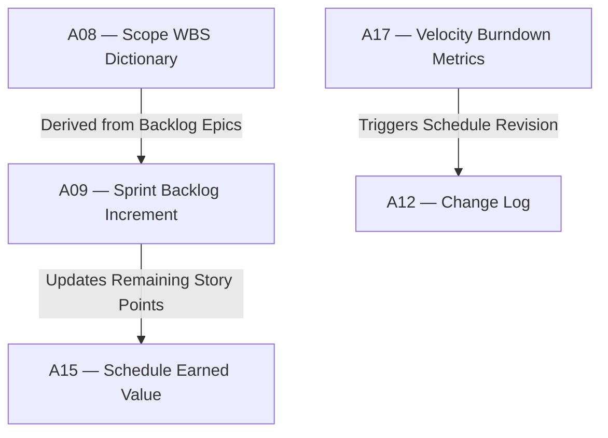

# IT-06 — Adaptive & Hybrid Overlay Integration Test
**Status:** Active
**Version:** 1.0.0
**Authority:** QUALITY-STANDARDS.md §7.5 Phase 6 gate
**File Path:** `tests/integration-tests/IT-06-hybrid-overlay.md`

---

## Purpose

This integration test verifies that adaptive (Agile) ceremonies, sprint backlog increments, and velocity metrics from **Pack 07 (Adaptive & Hybrid)** successfully overlay, sync, and control predictive schedules and cost baselines in **Pack 03/05 (Planning & Monitoring)**.

---

## Lifecycle Phase Mapping

This test validates the integration of:
1. **Adaptive/Hybrid Controls (Pack 07):** Iterations, Sprint Backlogs, and Retrospectives.
2. **Predictive Baselines (Pack 03 / Pack 05):** Core schedule milestones and cost accounts.

---

## Core Artifact Flow Traceability

---

## Test Cases

### Test Case 1: Sprint Velocity to Milestone Target Sync
*   **Scenario:** Verify that sprint velocity forecasts in Pack 07 calculate realistic delivery targets for hybrid milestones in schedule baselines (A15).
*   **Input:**
    *   `A09 §1.1` Backlog size remaining = `120 Story Points`
    *   `A17 §2.0` Average team velocity = `20 Story Points / Sprint`
    *   `A15 §3.1` Milestone "Beta Launch" target date = `in 5 weeks` (2.5 sprints)
*   **Expected Output:** Validation returns `WARN` status.
*   **Pass Criteria:** System flags milestone risk (needs 6 weeks / 3 sprints) and suggests backlog trimming or date buffer use.
*   **Failure Cases:** Milestone date matches but velocity trends are ignored, resulting in high-risk milestone failure.
*   **Authority Check:** Agile Coach and Project Manager.

### Test Case 2: Incremental Backlog-to-WBS mapping
*   **Scenario:** Verify that every newly approved epic in the Product Backlog is mapped to a Level-3 Work Package in the WBS Scope baseline (A08).
*   **Input:**
    *   `A09 §1.1` New Epic `EPIC-401` "Authentication Upgrade" added in Sprint 2.
    *   `A08 §2.2` Corresponding WBS Work Package `WP-104.2` is added.
*   **Expected Output:** Traceability validation returns `PASS`.
*   **Pass Criteria:** New agile scope triggers integrated WBS dictionary updates.
*   **Failure Cases:** Scope is built in sprint backlog but omitted from central repository WBS.
*   **Authority Check:** Product Owner and Systems Analyst.

### Test Case 3: Retrospective Improvement Action routing
*   **Scenario:** Verify that critical operational improvements identified in Retrospectives (A09) are added to the Issue and Action Log (A18).
*   **Input:**
    *   `A09 §4.2` Retrospective logs a blocking process issue on code approvals.
    *   `A18 §1.1` Action item `ACT-012` added with owner assigned.
*   **Expected Output:** Validation returns `PASS`.
*   **Pass Criteria:** Actions trace back directly to retrospective outcomes.
*   **Failure Cases:** Retrospective issues are logged but never tracked or owned.
*   **Authority Check:** Scrum Master.

---

*Authority: PMBOK8 Integration Management Domain · PMOSkills Repository*
