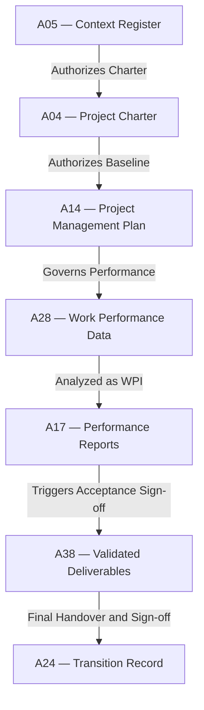

# IT-07 — End-to-End Full Project Lifecycle Integration Test
**Status:** Active
**Version:** 1.0.0
**Authority:** QUALITY-STANDARDS.md §7.5 Phase 6 gate
**File Path:** `tests/integration-tests/IT-07-full-lifecycle.md`

---

## Purpose

This integration test acts as the ultimate verification layer, tracing a single project thread end-to-end across **all 6 standard delivery lifecycle phases** (Packs 01 to 06) and the **Pack 07 hybrid/adaptive overlay**.

---

## Lifecycle Phase Mapping

This test validates the entire project lifecycle journey:
`Pack 01 (Setup) ➔ Pack 02 (Initiating) ➔ Pack 03 (Planning) ➔ Pack 04 (Executing) ➔ Pack 05 (Controlling) ➔ Pack 06 (Closing)`
with `Pack 07 (Adaptive/Hybrid)` overlays active during the planning, executing, and controlling phases.

---

## Core Artifact Flow Traceability

---

## Test Cases

### Test Case 1: Total Baseline Integrity Validation
*   **Scenario:** Execute a full end-to-end automated run of the baseline integrity checker to ensure WBS scope elements, schedule timelines, financial costs, and risks align perfectly without mathematical discrepancies.
*   **Input:**
    *   `A08 WBS` contains 25 Level-3 Work Packages.
    *   `A15 Schedule` maps exact start/finish dates for all 25 Work Packages.
    *   `A16 Budget` maps cost targets to all 25 Work Package codes.
*   **Expected Output:** Integrity validator returns `PASS` status.
*   **Pass Criteria:** 100% database match on all IDs and numeric budgets.
*   **Failure Cases:** Any mismatch in IDs or budget reconciliation.
*   **Authority Check:** PMO Director.

### Test Case 2: Multi-Phase Change Traceability
*   **Scenario:** Verify that an emergency change request raised during execution (Pack 04) is fully traced back to a Charter requirement (Pack 02) and forward to operational handover (Pack 06).
*   **Input:**
    *   `CR-021` raised under WBS Code `WP-203` to modify authentication protocols.
    *   Scope trace maps `WP-203` back to Charter requirement `REQ-04` from Pack 02.
    *   `CR-021` is resolved, implemented in execution, validated in Pack 05, and logged in handover `A24` in Pack 06.
*   **Expected Output:** Multi-phase path returns `PASS`.
*   **Pass Criteria:** Perfect bidirectional traceability across all phases.
*   **Failure Cases:** Broken traceability link at any intermediate phase gate.
*   **Authority Check:** CCB Chair and Sponsor.

### Test Case 3: Sustainability Target Verification
*   **Scenario:** Verify that carbon-neutral metrics defined in Pack 01 are successfully checked during monitoring and archived in decommissioning transition.
*   **Input:**
    *   `A05 §4.2` Target carbon footprint = `Zero net emissions`
    *   `A-NEW-SUST §3.1` Quarterly offset verification certificates logged.
    *   `A24 §4.0` Final compliance report confirms zero net emissions.
*   **Expected Output:** Validation returns `PASS`.
*   **Pass Criteria:** Actual close-out metrics match or exceed initial targets.
*   **Failure Cases:** Project closed out without final ESG offset validation.
*   **Authority Check:** PMO Sustainability Director.

---

*Authority: PMBOK8 Integration Management Domain · PMOSkills Repository*
